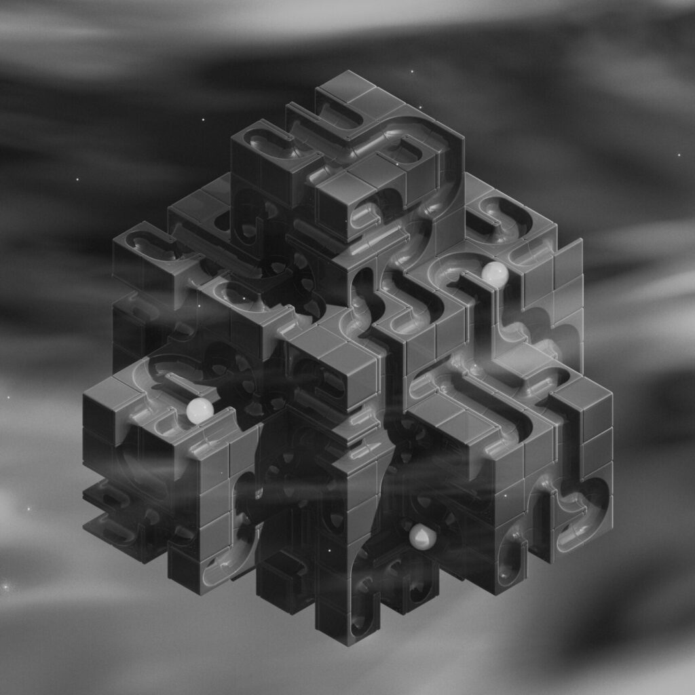
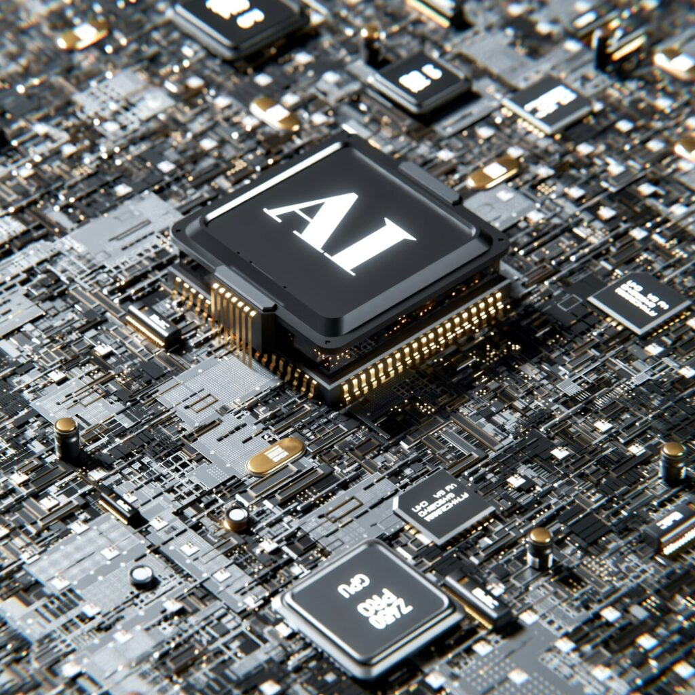
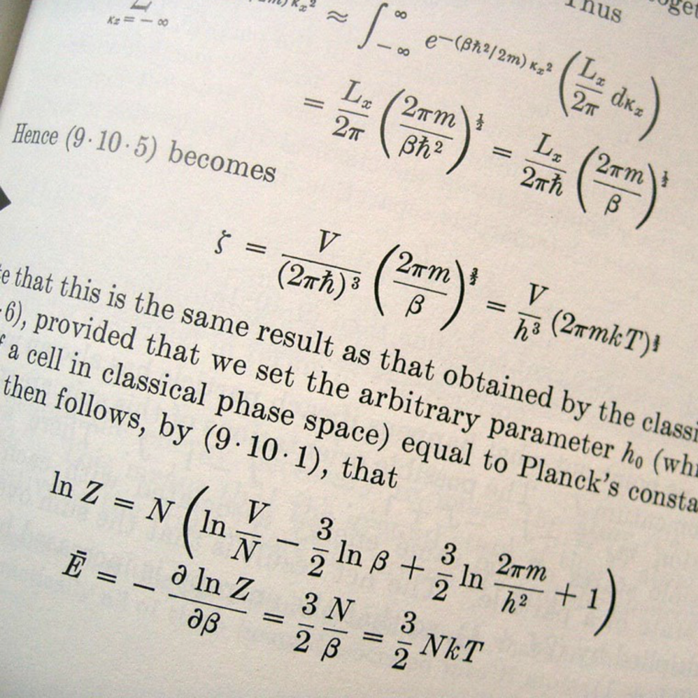

Bonjour, Je suis Édouard.

Je vous souhaite la bienvenue sur mon blog **NILRADICAL**. J'espère pouvoir vous faire partager ici ma passion pour les mathématiques et leur pouvoir de résolution au travers de la donnée et d'outils de programmation.

#### Mon parcours

Au départ plutôt d'un tempérament littéraire, je n'ai commencé à m'intéresser aux sciences que vers la fin du lycée. Au contact d'un professeur passionné, j'ai découvert que, loin des préjugés, les mathématiques sont philosophiquement riches et hautement créatives. L'orbite de mes études s'en trouva bouleversée et j'ai poursuivi pour des études d'ingénierie en grande école.

#### Mes expériences

2021 - Now

###### UI/UX Designer

Lerone Studio

As a UI/UX Designer, I create intuitive interfaces and engaging user experiences, blending creativity with usability to enhance digital interactions effectively.

2018 - 2021

###### Graphic Designer

Deboro Agency

As a graphic designer, I craft visually compelling solutions that blend creativity, strategy, and innovation to communicate brands' stories effectively.

2012 - 2018

###### Web Developer

Astro Group

As a web developer, I create responsive, user-friendly websites, specializing in custom designs, e-commerce solutions, CMS integration, and SEO optimization.

#### Mes intérêts

J'aime les chiens et la nature. La culture japonaise.

#### Contactez moi !

Que vous soyez en quête, n'hésitez pas a me contacter.

[Me contacter](#)
