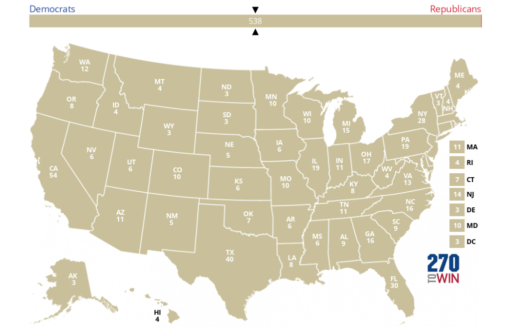
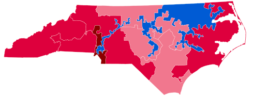
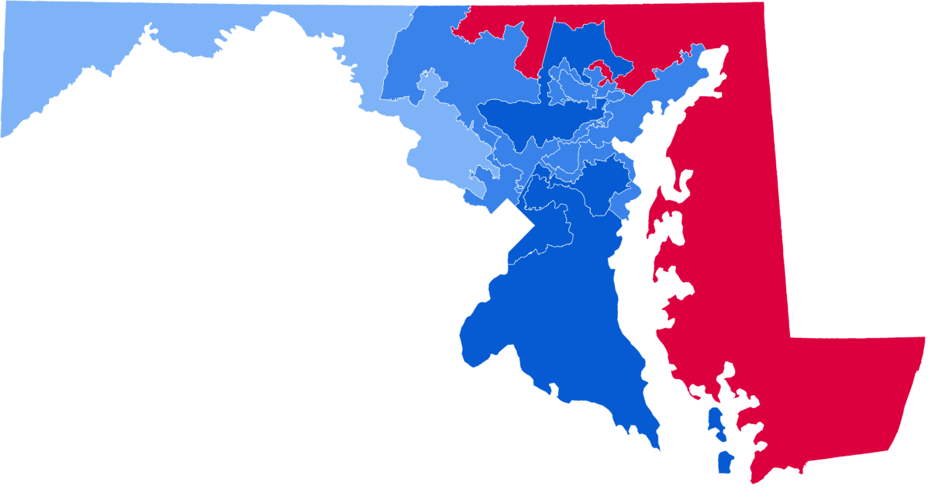
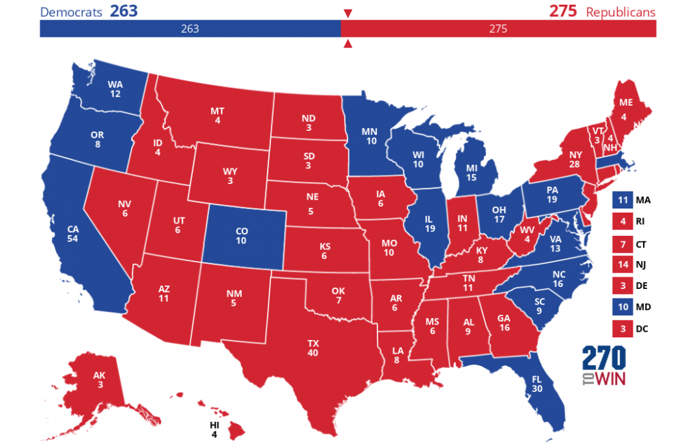
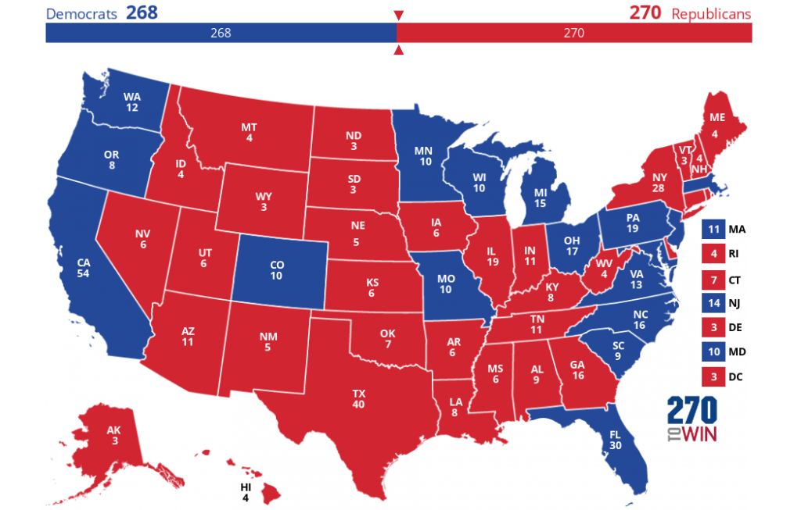

\[latexpage\]

Comme tous les quatre ans, les élections présidentielles vont avoir lieu aux États-Unis, et pour les « political junkies » dont je fais partie, l’excitation est à son comble. Les sondages nationaux montrent en effet le candidat républicain Donald Trump au coude-à-coude avec son adversaire démocrate, Kamala Harris. Cependant, cette situation n'est pas nécessairement de bon augure pour Harris, car l’élection ne se décide pas au suffrage direct, mais par le vote des grands électeurs. Dans les conditions actuelles, ce mode de scrutin désavantage les démocrates.

En effet, sur les six dernières éditions, bien que les deux grands partis aient obtenu trois victoires chacun, il est frappant de constater que dans le détail les républicains n'ont en réalité gagné le vote populaire qu'une seule fois en 2004 :

<figure>

| Année | Résultats Nationaux | Vainqueur |
| --- | --- | --- |
| 2000 | Gore (D) 48.4 % / Bush (R) 47.9 % | Bush |
| 2004 | Kerry (D) 48.3 % / Bush (R) 50.7 % | Bush |
| 2008 | Obama (D) 52.9 % / McCain (R) 45.7 % | Obama |
| 2012 | Obama (D) 51.1 % / Romney (R) 47.2 % | Obama |
| 2016 | Clinton (D) 48.2 % / Trump (R) 46.1 % | Trump |
| 2020 | Biden (D) 51.3 % / Trump (R) 46.8 % | Biden |

<figcaption>

Synthèse des dernières présidentielles américaines

</figcaption>

</figure>

Ainsi, en 2000 puis en 2016, les démocrates ont perdu l'élection tout en étant majoritaires en voix. Nous entamerons donc notre exploration du système électoral américain au travers de cette première question :

> Quel est le score minimal avec lequel il est imaginable de gagner la présidentielle américaine ?

## 1 ) Le Collège Électoral aux États-Unis

### a) Un peu d'histoire

Au moment de l’élaboration de la Constitution des États-Unis en 1787, les Pères fondateurs étaient confrontés à un défi complexe : comment élire le président d’une jeune nation composée d’états indépendants aux tailles, aux économies et aux populations très variées ?

Le débat sur la méthode d’élection de l’exécutif national était particulièrement vif. Ils se méfiaient en effet d’une élection populaire directe, craignant qu'elle ne marginalise certains États ou n'entraîne des clivages nationaux. Ils souhaitaient également éviter une élection parlementaire, redoutant qu'elle ne provoque des conflits d’intérêts. Le Collège électoral fut le compromis auquel ils aboutirent, visant à ménager une représentation démocratique basée sur la population tout en prenant en compte l’égalité entre les États.

Selon ce système hybride : chaque État se voit attribuer un nombre de grands électeurs égal à la somme de ses parlementaires au Congrès, soit ses représentants à la Chambre (dont le nombre varie en fonction de la population) et ses deux sénateurs (chaque État en ayant deux, quelle que soit sa taille).

Cette mécanique produit un nombre de grands électeurs approximativement proportionnel à la population, avec un terme correctif qui rehausse l'influence des États les moins peuplés. Par exemple, la Californie, l’État le plus peuplé, dispose de 55 grands électeurs, car elle compte 53 représentants et 2 sénateurs. En revanche, des États comme le Wyoming ou le Vermont, qui n'ont qu'un seul représentant, bénéficient tout de même de 3 grands électeurs : 1 représentant et 2 sénateurs. Ainsi, quel que soit leur poids démographique, tous les États disposent d'au moins trois grands électeurs, sur un total de 538.

### b) Le Collège Électoral en 2024

Plutôt que de considérer l'élection présidentielle comme un vote national strict, il est préférable de la voir comme une série de 51 élections menées simultanément (50 États plus le District de Columbia). Bien que chaque État puisse définir ses propres règles pour désigner ses grands électeurs, la plupart ont adopté le système du _**winner-takes-all**_, le gagnant rafle la mise, selon lequel l’ensemble des grands électeurs est attribué au candidat qui a obtenu la majorité des voix dans l’État, quel que soit l’écart de voix.

Deux exceptions notables : le Maine et le Nebraska utilisent un système dit "par district". Dans ces États, chaque district de la Chambre des représentants attribue un grand électeur au candidat gagnant dans ce district, tandis que les deux grands électeurs restants reviennent au gagnant du vote populaire global de l’État. Ce système reflète mieux la répartition des votes dans l’État. Par souci de simplification, nous supposerons toutefois que ces États suivent également la règle du _winner-takes-all_.

Voici la distribution du Collège électoral pour 2024, tirée de l'excellent site _270towin_ :

<figure>



<figcaption>

Collège Électoral en 2024

</figcaption>

</figure>

Le nom du site (littéralement "270 pour gagner") est d'ailleurs une référence directe au nombre de grands électeurs requis pour atteindre la majorité absolue au Collège électoral et remporter l'élection présidentielle (270 sur 538).

En théorie, le système démocratique américain n’est pas strictement bipartite, puisqu'aucune règle constitutionnelle ne l’exige. Cependant, on comprend facilement comment la logique du _winner-takes-all_ encourage le vote utile, rendant difficile l’émergence de partis alternatifs et consolidant la domination des deux principaux partis. Par conséquent, nous admettrons ici un système à deux partis et normaliserons les données historiques des élections précédentes en conséquence.

## 2) Biais de représentation

### a) Exemple

La question posée en introduction demeure : comment est-il possible de remporter une élection tout en étant minoritaire en voix ? Nous allons montrer, à l’aide d’un exemple simple, comment une représentation indirecte peut rendre cela possible.

Imaginons un pays composé de deux États, A et B, où A représente 60 % de la population et B, 40 %. Chaque citoyen a le droit de voter pour l’un des deux partis : le parti Bleu ou le parti Rouge. Les électeurs se répartissent comme suit :

Plutôt que d'organiser un vote national direct, chaque État se voit accorder un nombre de délégués proportionnel à sa population, soit 6 délégués pour l'État A et 4 pour l'État B.

En appliquant la règle du _winner-takes-all_, le parti Rouge gagne dans l’État A (4-2) et obtient 6 délégués, tandis que le parti Bleu gagne dans l’État B (4-0) et obtient 4 délégués. **Résultat :** le parti Rouge remporte donc l’élection générale avec un score de 6 à 4, bien qu'il ne compte que 40 % des voix totales.

Cet exemple simple illustre plusieurs concepts-clés :

- La répartition des délégués rend le résultat de l’État B parfaitement secondaire : remporter l’État A seul assure la victoire finale

- La règle du _winner takes all_ dans un État revient à annuler le gain électoral du parti minoritaire, indépendamment des marges de score. **Le gagnant a donc intérêt à gagner avec une marge minimale de sorte à neutraliser le maximum de voix adverses**.

- Symétriquement, quitte à perdre un état, peu importe la marge de défaite. **Concentrer les voix adverses dans un état "sacrificiel" permet de limiter le gaspillage de ses propres voix.**

### b) Stratégie d'optimisation électorale

Si un parti pouvait définir le découpage électoral, il pourrait utiliser ces concepts pour maximiser ses chances de succès :

1. Le **cracking** consiste à disperser les électeurs de l’opposition dans plusieurs circonscriptions, affaiblissant leur capacité à constituer une majorité dans aucune d'elles. Idéalement, il s’agit de garantir une victoire avec la plus faible marge possible, mais cette stratégie doit être appliquée prudemment. En effet, si le paysage électoral évolue, la moindre érosion de soutien pourrait inverser les résultats pour le parti dominant. Un équilibre autour de 60-40 est souvent recherché.

3. Le **packing** consiste à concentrer les électeurs de l’opposition dans un petit nombre de circonscriptions, limitant leur impact dans le reste du territoire. Bien que cela garantisse quelques victoires pour l’opposition, cela réduit sa capacité à remporter d’autres sièges. Pour être efficace, cette stratégie vise à minimiser la "perte" de voix pour le parti dominant en se concentrant sur des zones jugées impossibles à gagner

Ces techniques de manipulation électorale ne sont pas de simples idées abstraites ; elles ont bel et bien cours dans la politique américaine (et partout ailleurs). La pratique est si bien connue qu'elle a son propre nom : le _**gerrymandering**_. Ce terme provient lui-même d’un cas célèbre datant de 1812, dans le Massachusetts, où le gouverneur Elbridge Gerry approuva un découpage alambiqué qui favorisait son parti. L'une des circonscriptions redessinées était si sinueuse qu'elle évoquait la forme d’une salamandre, d’où le jeu de mots éponyme « Gerry-mander ».

Des contours irréguliers, voire "charcutés" trahissent souvent la présence de gerrymandering, car ils sont dictées par des critères d’optimisation plutôt que par des réalités géographiques. Avec le développement des technologies et des données démographiques, il est en effet devenu possible de concevoir des découpages biaisés de plus en plus finement. Nous aborderons dans un prochain article les méthodes mathématiques pour favoriser ou contrer cette pratique.

On peut citer des exemples récents comme en 2016 en Caroline du Nord. En dépit d'une répartition presque égale entre démocrates et républicains, le tortueux découpage des districts par les législateurs républicains a permis une surreprésentation de ces derniers au Congrès :

<figure>



<figcaption>

Caroline du Nord : 10 républicains - 3 démocrates

</figcaption>

</figure>

Mais le _gerrymandering_ n'est pas l'apanage des seuls républicains : un autre exemple remarqué est celui du Maryland en 2011, où ce sont cette fois les démocrates qui ont concentré les électeurs républicains dans une seule circonscription :

<figure>



<figcaption>

Maryland : 1 républicain - 7 démocrates

</figcaption>

</figure>

Ces exemples montrent à quel point le gerrymandering est répandu et amènent à réfléchir aux limites de cette pratique. Nous tenterons ainsi de quantifier dans quelle mesure ces stratégies peuvent générer des résultats paradoxaux à l’échelle nationale

## 3) Résolution de l'Énigme

Dans cette expérience de pensée, nous inverserons le _gerrymandering_ en déterminant la répartition de la population qui permettrait de gagner strictement l'élection présidentielle (nous excluons les cas d'égalité au niveau d'un état ou du Collège Électoral) avec le minimum de voix populaires possible.

### a) Première modélisation

En reprenant, le pays fictif de l'introduction, et en poussant le cracking et le packing aux limites, on observe la répartition optimale suivante pour N votants :

|  | **État A**   6 délégués | **État B**   4 délégués |
| --- | --- | --- |
| Parti Rouge | 1 | 0 |
| Parti Bleu | 0 | N-1 |
| **Total** | **1** | **N-1** |

Dans cette hypothèse, le Parti Rouge remporte l’État A avec seulement une voix, tandis que le Parti Bleu concentre tous ses votes dans l’État B. Ce mécanisme permet au Parti Rouge de remporter l’élection générale avec une seule voix.

En étendant cette logique, nous pouvons reproduire ce schéma dans un nombre minimal d’États (ceux ayant le plus de grands électeurs), et en déduire que **13 voix populaires** suffiraient en principe à remporter la présidence.

### b) Deuxième modélisation

Cet exemple est éclairant mais un peu caricatural, car il suppose qu'une élection au niveau d'un État entier ne compte qu'un seul électeur. Pour une approche plus réaliste, nous imposons que le nombre de votants par État corresponde aux chiffres de participation observés lors de la dernière élection.

Cette hypothèse est sujette à débat, car les taux de participation varient d'une élection à l'autre et ceux de 2020 étaient largement influencés le potentiel de bascule que chaque État avait alors Néanmoins, nous l'adopterons par simplicité et car elle offre une base de calcul pertinente.

En reprenant l’exemple des deux États A et B et en notant **n**a et et **nb** leurs nombres de votants respectifs :

|  | **État A**   6 délégués | **État B**   4 délégués |
| --- | --- | --- |
| Parti Rouge | $E \[n\_a / 2 \]+ 1$ | 0 |
| Parti Bleu | \*\*\* | nb |
| **Total** | **na** | **nb** |

L'expression $E\\left\[n\_a /2 \\right\] + 1$ est égale au nombre minimal de voix nécessaires pour gagner l’État A indépendamment de la parité de na et en excluant l’égalité. Cette quantité introduit une notion de « coût » nécessaire pour obtenir les grands électeurs d'un État donné.

### c) Première heuristique d'approche

Pour tenter de former la coalition gagnante au coût minimal, nous pouvons adopter une approche heuristique : prioriser les États qui exigent le moins de voix pour le plus grand nombre de grands électeurs, soit les meilleurs ratios "grands électeurs" par "voix populaires".

Cette méthode va donc classer les États par rentabilité électorale, et les ajouter progressivement en partant du plus avantageux jusqu'à atteindre les 270 grands électeurs nécessaires. Concrètement, avec Python :

Nous obtenons qu'un total de 35,474,356 de voix, soit **21.87 %**, suffisent pour gagner l'élection présidentielle avec la coalition suivante :



Cette approche est efficace pour estimer rapidement une solution, mais elle n'atteint pas nécessairement l'optimum. Examinons pourquoi à l’aide d’un exemple simple. Supposons que nous ayons trois États fictifs, A, B, et C avec les caractéristiques suivantes :

| État | Grands électeurs | Voix nécessaires   pour gagner | Efficacité   k EV / voix |
| --- | --- | --- | --- |
| A | 12 | 11 500 | 1.04 |
| B | 6 | 6 600 | 0.91 |
| C | 4 | 4 400 | 0.91 |

Si l’objectif est de d'atteindre au moins 10 grands électeurs avec un minimum de voix, l’heuristique nous pousse à choisir seulement l’État A dès le départ ce qui fournirait **12 grands électeurs** (2 de plus que ce qui est requis) pour **11 500 voix**.

Cependant, en prenant les États B et C, on obtient un total de **10 grands électeurs** soit exactement le compte requis (6 de B + 4 de C) pour **11 000 voix** (6 600 + 4 400), Bien que l'efficacité de ces états à convertir leurs voix en grands électeurs soit inférieure à celle de A, leur combinaison permet d'atteindre le minimum absolu.

La raison pour laquelle notre heuristique échoue à capturer la solution optimale réside dans la nature binaire du problème : on ne peut sélectionner un État que dans sa totalité ou pas du tout. L'État A, bien qu’il offre la meilleure rentabilité en termes d'électeurs par voix, dépasse le nombre nécessaire de grands électeurs.

Plus précisément, si l'état A était fractionnable, c'est à dire si on pouvait puiser 10 de ses 12 grands électeurs avec 5/6 de ses voix, la solution heuristique serait optimale. Cependant, comme ce n’est pas possible, les États B et C, bien que moins rentables individuellement, s’ajoutent de manière plus efficace pour atteindre le seuil requis de 10 grands électeurs.

Tout se passe comme si on cherchait à "bourrer" une valise avec le plus d'objets possible. Or, parfois, les dimensions du "meilleur" objet s'insèrent mal. On aura alors plus grand bénéfice d'en choisir deux de moindre valeur mais qui rentrent tout juste. Cette comparaison n’est pas qu’une simple métaphore : c’est précisément l’essence du problème d’optimisation classique auquel notre situation se rattache.

### d) Le problème du sac à dos

Dans le problème du sac à dos, on dispose de $n$ objets. Chaque objet $i$ a un poids $w\_i$​ et une valeur $v\_i$​. On cherche le remplissage optimal du sac, c'est à dire à la manière de maximiser la valeur totale des objets placés dedans sans que la somme des poids ne dépasse la capacité maximale $W$. Les décisions sont binaires, c’est-à-dire qu’un objet est soit pris en entier, soit laissé de côté .

Gagner l'élection avec le minimum de voix se ramène donc bien à une instance de ce problème de la classe NP, en considérant chaque État comme un "objet" à sélectionner ou exclure et ayant pour caractéristiques :

- un coût $c\_i$ : les voix nécessaires à la victoire dans cet État

- une valeur $p\_i$ : le gain obtenu en grands électeurs en cas de victoire

ll faut choisir la combinaison d’États, représentée par des variables binaires $x\_i$​ (où $x\_i = 1$​ signifie que l’État $i$ est sélectionné, et $x\_i = 0$​ qu’il ne l'est pas), de manière à minimiser le total des voix, tout en respectant la contrainte que la somme des grands électeurs atteigne ou dépasse 270.

La formulation mathématique de ce problème est donc :

1. **Minimiser le coût total en voix populaires**  
    \\\[  
    \\min \\sum\_{i=1}^{N} c\_i \\cdot x\_i  
    \\\]

3. **Sous la contrainte d'une victoire au Collège Électoral :**  
    \\\[  
    \\sum\_{i=1}^{N} p\_i \\cdot x\_i \\geq 270  
    \\\]

5. **Avec des variables binaires :**  
    \\\[  
    x\_i \\in \\{0, 1\\} \\quad \\forall i = 1, \\dots, N  
    \\\]

Stricto sensu, la direction de notre problème diffère de celle du sac à dos : nous recherchons un coût minimal au dessus d'une contrainte de valeur minimale, et non une valeur maximale en-dessous d'une capacité maximale. Néanmoins, les principes de résolution restent les mêmes pour les deux formulations.

### e) Résolution avec Python

Nous utiliserons le module PuLP pour déterminer les solutions numériques de ce problème.

```
1. Initialiser le problème de minimisation
problem = LpProblem("Minimum_Popular_Votes_for_Election", LpMinimize)

# 2. Définir les variables de décision pour chaque État (0 ou 1, binaire)
variables = {state: LpVariable(f"x_{state}", 0, 1, LpBinary) for state in states}

# 3. Définir la fonction objectif : Minimiser le nombre total de voix populaires
problem += lpSum(states[state]['cost'] * variables[state] for state in states), "Total_Popular_Votes"

# 4. Ajouter la contrainte sur les votes électoraux (doit être >= 270)
problem += lpSum(states[state]['electoral_votes'] * variables[state] for state in states) >= 270, "Electoral_Votes_Requirement"

# 5. Résoudre le problème
problem.solve()

# 6. Afficher les résultats
print("Statut de la solution:", problem.status)
print("Nombre minimum de voix populaires nécessaires :", int(problem.objective.value()))
print("États à gagner pour atteindre le minimum de voix populaires:")

for state in states:
    if variables[state].value() == 1:
        print(f" - {state}: {states[state]['electoral_votes']} votes électoraux")
```

**Réponse** : avec une participation identique à celle de 2020, un candidat pourrait remporter la présidentielle avec seulement 34,867,679 voix, **soit un score de seulement 21,50 %**. L’approche fractionnaire évoquée en partie c) a donc permis d’obtenir une estimation en pratique très proche de l’optimum, même si nous l'améliorons ici de plus de 600,000 voix.

Cette efficacité s'explique par le caractère granulaire de nos données : les unités sont relativement nombreuses et petites (aucun État n'a à lui seul le sort de l'élection entre ses mains), de sorte à ce que les solutions binaires et fractionnaires utilisent en fait en grande partie la même combinaison d’États.

La différence réside essentiellement dans une erreur d’arrondi que la solution fractionnaire va introduire en ne tenant pas compte du seuil précis de 270, là où la solution binaire visera pile ce compte :



### Conclusion

Ce résultat de **21.50%** est étonnamment bas ! À peine un cinquième des électeurs aurait autant de pouvoir que les quatre cinquième restants ? Rappelons que cela résulte d’un contexte de simulation où l’on pousse la logique du gerrymandering à ses limites les plus extrêmes, au point de ne plus correspondre à un contexte réaliste. Dans cette coalition fictive, tous les États rouges sont gagnés à une voix près, tandis que tous les États bleus ne contiennent strictement aucune voix rouge.

Toujours est il que ces résultats interrogent sur les biais de représentation qu'induisent un système électoral pareil à celui-ci. Nous allons dans la prochaine partie de cette série quantifier le biais réellement observé en 2020, servant de base pour le cycle électoral actuel. Nous tiendrons en particulier compte de la répartition des affiliations politiques véritablement observée.

Le gerrymandering montre à quel point les mathématiques peuvent être utilisées pour manipuler des élections, mais elles peuvent également être utilisées pour les surveiller et les rendre plus justes, grâce à des outils comme l’écart d’efficacité ou les simulations basées sur la théorie des graphes.
