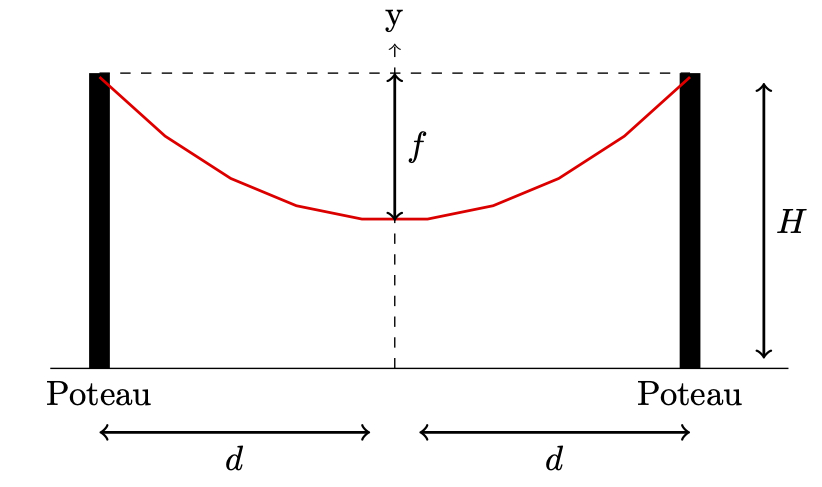
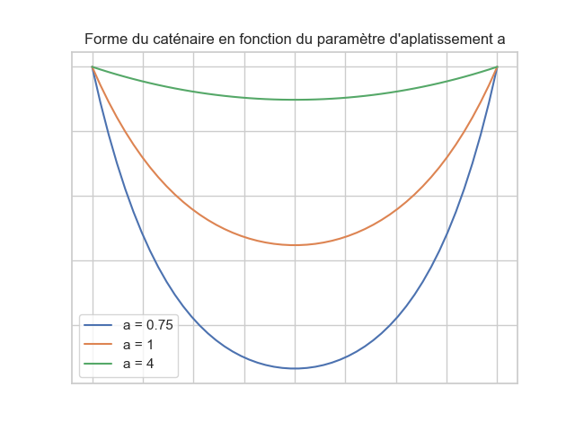
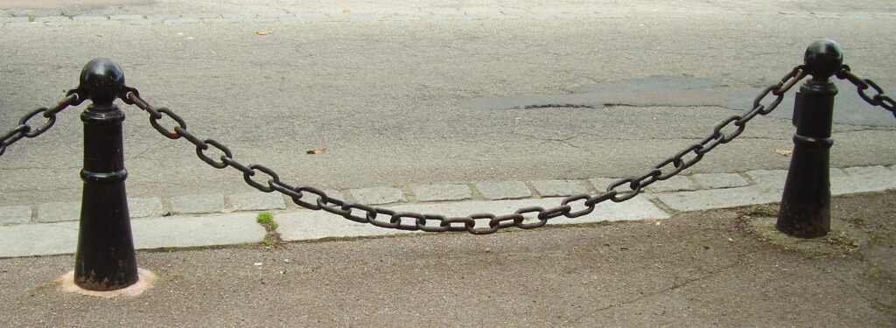
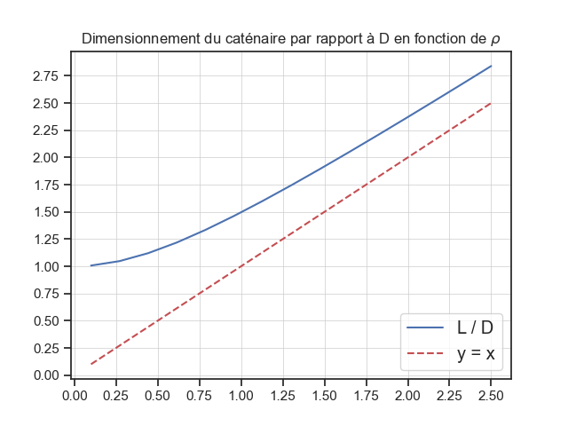
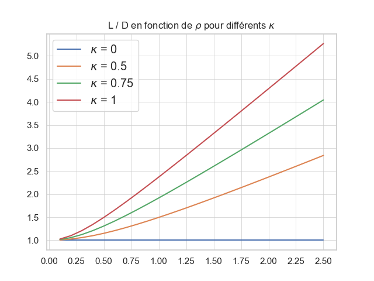

\[latexpage\]

Quel point commun y a t-il entre un pont suspendu, l'ancre d'un bateau et une clôture de sécurité ? Ce lien c'est la chainette ou caténaire : le nom de la courbe que dessine un fil tendu entre deux extrémités. Comme Galilée en fit la remarque, la chainette ressemble à une simple parabole mais s'en distingue.

## 1\. Énoncé

Mettons nous dans la peau d'un gardien souhaitant bloquer efficacement un passage. Il dispose pour cela de deux poteaux immobiles dont il connait l'espacement $D = 2d$ et la hauteur $H$. Il voudrait délimiter une cloture au moyen d'une chaine comme sur le schéma ci-dessous :

<figure>



<figcaption>

Schéma de l'énigme

</figcaption>

</figure>

Vigilant, notre vigile procède à tâtons. Il commence par utiliser une chaine relativement longue, mais s'aperçoit vite qu'elle ne convient pas : la clôture s'approche en effet trop près du sol et il suffit de l'enjamber pour la franchir. Mais à l'inverse, lorsqu'il en utilise une plus courte, il remarque qu'elle ne descend plus assez cette fois. C'est maintenant par dessous qu'il imagine sans mal des intrus pouvoir se glisser.

À l'issue de ces essais, il en conclut que la chaine optimale est celle pour laquelle la profondeur du creux, appelée aussi flèche et notée $f$, arrive exactement à mi-hauteur des poteaux. Quelle dimension exacte de chaine $L$ notre gardien doit utiliser pour parvenir à ses fins ?

## 2\. La Courbe de la Chainette

La solution est assez simple à approcher en pratique : il suffit de partir d'une corde volontairement trop longue puis de progressivement la faire glisser jusqu'à ce que le creux esquissé atteigne le niveau désiré.

Le calcul précis n'est toutefois pas aussi aisé que cela et, notamment, sa solution n'a pas de forme fermée. Eh oui, comme pour de nombreux problèmes réels, cela signifie qu'il faudra en passer par des approximations numériques.

### a) Bilan infinitésimal des forces

Pour commencer, nous allons nous plonger dans un peu de physique pour décrire l'équation du caténaire, qui est la forme prise par une chaine inélastique et homogène au repos lorsqu'elle est tendue entre deux points et soumise à son poids.

Nous réalisons pour ce faire un bilan des forces sur un élément infinitésimal de la corde. Le principe fondamental de la dynamique indique qu'à l'équilibre la somme des forces exercées sur ce morceau doit se compenser :

\\\[  
\\sum \\mathbf{F} = \\mathbf{0}  
\\\]

En faisant l'hypothèse que la corde est homogène, sa masse est uniformément répartie permettant d'écrire que $\\mathrm{d}m = \\mu \\mathrm{d}s $. Par conséquent dans un champ de pesanteur uniforme, le poids s'exprime :

\\\[  
\\mathbf{P} = - \\mu \\mathrm{g} \\, \\mathrm{d}s \\, \\mathbf{u}\_z  
\\\]

En utilisant la non rigidité, on arrive finalement à :

\\\[  
\\frac{dy}{dx} = \\frac{\\mu g}{T\_0} s = \\frac{s}{a}  
\\\]

en posant $a = \\frac{T\_0}{\\mu g}$.

Or, l'abscisse curviligne $s$ peut également être exprimée comme :

\\\[  
s = \\int\_{}^{} \\, \\sqrt{1 + \\left( \\frac{dy}{dx} \\right)^2} \\mathrm{d}x  
\\\]

On peut en déduire une équation différentielle sur $y$ d'ou en découle sa forme.

### b) Équation de la chainette

Il en résulte que l'équation de la chainette est la suivante :

\\\[  
y (x)= a \\cosh\\left(\\frac{x}{a}\\right) + C \\tag{1}  
\\\]

où :

- $a$ est un paramètre caractérisant l'« aplatissement » de la chainette

<figure>



<figcaption>

Figure 1

</figcaption>

</figure>

Lorsque $a$ augmente, on a une chainette plus tendue, tandis que pour des valeurs faibles elle marquera un creux relativement plus important.

- $C$ est une constante dépendant du choix de repère

Comme pour la position de l'axe des ordonnées, il est possible d'adapter le repère pour avoir $ C = 0$. C'est ce que nous allons faire pour le reste des calculs de sorte à simplifier l'expression de $y$.

Il est remarquable que même si la masse linéique apparait dans la définition du paramètre d'aplatissement $a$, la forme du caténaire est indépendante de la nature du matériau sous les hypothèses considérées : ce sont les points de fixation qui la déterminent.

En pratique, nous pouvons appliquer notre étude à une large gamme de cas : chaine de pendentif, fil de corde, câble libre...

## 3\. Mise en équation

Maintenant que nous avons établi l'équation du caténaire, nous allons pouvoir en déduire les équations que doivent vérifier les autres paramètres.

### a) Expression de la flèche :

On dérive de l'équation du caténaire :

\\\[  
f= y \\left( d \\right) - y \\left( 0 \\right) = a \\cosh\\left(\\frac{d}{a}\\right) -a  
\\\]

ou encore :

\\\[  
f = a \\left\[ \\cosh\\left(\\frac{d}{a}\\right) -1\\right\] \\tag{2}  
\\\]

### b) Expression de la longueur du caténaire

En calcul différentiel, l'expression générale de la longueur d'une courbe est fournie par l'intégration de son abscisse curviligne :

\\\[  
L = \\int\_{-d}^{d} \\, \\mathrm{d}s = s(d) - s(-d)  
\\\]

Or, d'après le bilan des forces, le caténaire se caractérise justement par une abscisse curviligne réalisant :

\\\[  
s = a \\frac{dy}{dx}  
\\\]

On peut donc retrouver l'expression de $s$ par dérivation de $y$ :

\\\[  
s (x) = a \\sinh\\left(\\frac{x}{a}\\right)  
\\\]

Enfin, avec l'imparité de $s \\left( -d \\right) = -s \\left(d \\right)$, on obtient l'expression de $L$ :

\\\[  
L = 2a \\sinh\\left(\\frac{d}{a}\\right) \\tag{3}  
\\\]

### c) Équation sur la flèche

Jusque là, les équations sont valides quelles que soient la hauteur de la flèche et la longueur de corde. Nous allons exprimer la condition recherchée par le gardien, c'est à dire que la base du creux doit se situer à soit à mi-hauteur :

\\\[  
f = \\frac{H}{2}  
\\\]

ce qui nous donne avec l'équation $(2)$ :

\\\[  
\\frac{H}{2} =a \\left\[ \\cosh \\left( \\frac{d}{a} \\right) -1 \\right\]  
\\\]

L'astuce est de diviser chaque membre par $d$. Le membre de gauche devient alors :

\\\[  
\\frac{H}{2d} = \\frac{H}{D}  
\\\]

tandis que le membre de droite devient :

\\\[  
\\frac{a}{d} \\left\[ \\cosh\\left(\\frac{d}{a}\\right) -1 \\right\]  
\= \\frac{ \\cosh\\left(\\frac{d}{a}\\right) -1}{\\frac{d}{a}}  
\\\]

Ainsi, en introduisant les deux paramètres pratiques de dimensionnement :

\\\[  
\\rho = \\frac{H}{D} \\text{ , } x\_\\rho = \\frac{d}{a}  
\\\]

l'équation sur le niveau de la flèche peut se réécrire de façon condensée :

\\\[  
\\rho = \\frac{ \\cosh\\left(x\_\\rho \\right) -1}{x\_\\rho} \\tag{4}  
\\\]

Le paramètre $\\rho$ introduit un dimensionnement caractéristique du problème. Il évalue la hauteur relative des poteaux par rapport à leur espacement. Des valeurs de $\\rho$ faibles caractérisent des situations ou les poteaux sont relativement éloignés par rapport à leur hauteur, tandis que des valeurs de $\\rho$ fortes décriront des cas ou la hauteur des poteaux est grande relativement à la distance les séparant.

<figure>



<figcaption>

Un cas $\\rho$ faible

</figcaption>

</figure>

## 3\. Calcul de la Longueur du Caténaire

### a) Approche de résolution

La formule que nous venons d'établir invite à introduire la fonction $\\phi$ :

\\\[  
\\phi (x) = \\frac{ \\cosh\\left(x \\right) -1}{x}  
\\\]

L'équation $(4)$ se condense ainsi en $\\phi (x\_\\rho) = \\rho$. On va établir l'existence et l'unicité de la solution à cette équation :

\\\[  
\\forall \\rho > 0, \\; \\exists ! x\_\\rho > 0 \\text{ tel que : } \\phi(x\_\\rho) = \\rho  
\\\]

* * *

**Démonstration** : La fonction $\\phi$ est définie sur $\\mathbb{R}^{+\*}$ mais admet un prolongement $\\mathcal{C}^1$ en 0 comme le montre son développement limité à l'orde 1.

En effet, puisque :

\\\[  
\\cosh (x) = 1 + \\frac{x^2}{2} + \\underset{x \\to 0}{o(x^2)}  
\\\]

on a :

\\\[  
\\phi (x) = \\frac{ \\cosh\\left(x \\right) -1}{x} = \\frac{x}{2} + \\underset{x \\to 0}{o(x)}  
\\\]

De plus, la fonction $\\phi$ est dérivable sur $\\mathbb{R}^+$ et :

\\\[  
\\phi' (x) = \\frac{ x\\sinh (x) -( \\cosh(x) - 1) }{x^2} = \\frac{ N(x) }{x^2}  
\\\]

Le signe de $\\phi'$ n'est pas évident, on va donc poursuivre en étudiant les variations du numérateur $N$ introduit ci-dessus.

La fonction $N$ est également dérivable sur $\\mathbb{R}^{+}$ avec :

\\\[  
N' (x) = x \\cosh(x) \\geq 0  
\\\]

Par conséquent, la fonction $N$ est strictement croissante avec $N(0) = 0$. Donc, pour tout $x >0$, $N(x) > 0 \\implies \\phi'(x) > 0$. Finalement, $\\phi$ est strictement croissante avec $\\phi(0) = 0$ et $\\phi(x) \\underset{x \\to \\infty}{=} +\\infty $.

La fonction $\\phi$ réalise ainsi une bijection de $\\mathbb{R}^{+}$ sur lui-même, impliquant que pour tout $x>0$, l'équation $\\phi(x) = \\rho$ n'admet qu'une seule solution : $x\_\\rho = \\phi^{-1}(\\rho)$ (la notation cherche à insister sur la dépendance à $\\rho$).

* * *

Le paramètre $x\_\\rho$ est ainsi déterminé de manière univoque par $\\rho$ bien qu'il ne puisse être explicité plus directement car $\\phi^{-1}$, la réciproque de la fonction $\\phi$, n'a pas de forme fermée. Nous pouvons toutefois l'estimer avec Python :

```
<pre><code class="language-python">
import numpy as np
from scipy.optimize import fsolve

def equation(x, rho):
    return (np.cosh(x) - 1)/x - rho

def calculate_x(rho_values):
    results = []
    for rho in rho_values:
        l = fsolve(equation, x0=1, args=(rho))[0]
        results.append(l)
    return results
</code></pre>
```

Il s'en suit que $a = d / x\_\\rho$ peut être aussi estimé et finalement $L$. Nous allons plutôt exprimer ce dernier paramètre avec $x\_\\rho$ seul grâce à une astuce :

\\\[  
L = 2a \\sinh\\left(\\frac{d}{a}\\right) = 2 d \\frac{a}{d} \\sinh\\left(\\frac{d}{a}\\right)  
\\\]

\\\[  
L = D \\frac{\\sinh (x\_\\rho )}{x\_\\rho} \\tag{5}  
\\\]

### b) Analyse de graphe

Cette forme revêt une signification physique intéressante : elle exprime $L$ à partir de $D$ et d'un nouveau facteur $\\sinh (x\_\\rho ) / x\_\\rho$ uniquement dépendant du dimensionnement caractéristique.

Cela nous permet de tracer le rapport $L/D$ comme une fonction de $\\rho$ avec Python :

<figure>



<figcaption>

Figure 2

</figcaption>

</figure>

Le fait que la courbe soit au-dessus de 1 est cohérent avec notre modélisation puisque $L > D$ : la courbe doit être au moins aussi grande que l'espace qu'il y a entre les poteaux. L'équation $(5)$ permet également d'étudier le comportement aux limites de cette fonction.

- **Cas $\\rho \\ll 1$ :**

Comme $\\phi (0) = 0$, $x\_\\rho = \\phi^{-1}(0) \\underset{\\rho \\to 0}{\\to} 0 $, et avec $ \\sinh (x) \\underset{x \\to 0}{\\sim} x$ :

\\\[  
L \\underset{\\rho \\to 0}{\\sim} D \\frac{\\sinh (x\_\\rho )}{x\_\\rho} \\sim D \\frac{x\_\\rho}{x\_\\rho} \\sim D  
\\\]

Physiquement, si $x\_\\rho = a/d \\to 0 $ pour $d$ fixe, l'aplatissement $a \\to \\infty$ ce qui traduit que pour des poteaux très éloignés la courbe s'aplatit en une corde tendue horizontalement, d'ou encore $L \\sim D$.

- **Cas $\\rho \\gg 1$ :**

Inversement, comme $ \\displaystyle \\lim\_{x \\to \\infty}\\phi (x) = + \\infty$ et que $x\_\\rho = \\phi^{-1}(\\rho)$ alors $\\displaystyle \\lim\_{\\rho \\to \\infty} x\_\\rho = + \\infty $.

En remarquant que :

\\\[  
\\frac{\\sinh (x)}{x} \\underset{x \\to \\infty}{\\sim} \\phi (x)  
\\\]

on obtient en composant les équivalents **par la droite** que :

\\\[  
\\frac{\\sinh (x\_\\rho)}{x\_\\rho} \\underset{\\rho \\to \\infty}{\\sim} \\rho  
\\\]

On retrouve le comportement asymptotique linéaire : $L \\underset{\\rho \\to \\infty}{\\sim} D \\rho = H$. Physiquement on a cette fois-ci un aplatissement qui tend vers 0, traduisant une corde "en coude", avec une descente suivie d'une remontée toutes deux quasi verticales, ce qui justifie que $L \\sim H$.

## 4\. Développements

### a) Cas général pour différentes flèches

Le travail mené nous permet d'étendre la résolution ou la flèche ne serait pas forcément à mi-hauteur, mais pour n'importe quel cas. En effet, en prenant $f = \\kappa H$ avec $0 < \\kappa < 1$, l'équation de la flèche devient alors :

\\\[  
\\phi \\left( \\frac{d}{a} \\right) = 2 \\kappa \\rho  
\\\]

Le rapport $x\_\\rho^{\\kappa}$ satisfaisant cette équation se déduit par homothétie du cas $\\kappa = 1/2$ précédemment étudié :

\\\[  
x\_\\rho^{\\kappa} = x\_{\\rho'} \\text{ avec } \\rho' = \\frac{\\rho}{2\\kappa}  
\\\]

Voici les courbes obtenues pour le rapport $L/D$ en fonction de $\\rho$ pour différentes valeurs de $\\kappa$ :

<figure>



<figcaption>

Figure 3

</figcaption>

</figure>

Pour $\\kappa = 0$, la flèche doit se situer à hauteur des poteaux est donc la corde est horizontale, donc $L/D = 1$.

Le cas $\\kappa = 1$ est plus fécond. Ce cas exprime la dimension critique de chaine au moment ou elle commence à toucher le sol. On peut voir la figure ci-dessus comme un encadrement du cordage possible :

\\\[  
1 = \\frac{L}{D} (\\kappa = 0) < \\frac{L}{D} < \\frac{L}{D} (\\kappa = 1)  
\\\]

Ainsi, pour $\\rho = 1$, c'est à dire un espacement des poteaux égal à leur hauteur, il faut sélectionner une corde dont la longueur est au plus de $\\approx 2.5 D$ pour éviter qu'elle ne touche le sol.

### b) Problème dual

On pourrait s'intéresser au cas "dual", celui ou la chaine est cette fois-ci d'une longueur fixe donnée et les poteaux sont mobiles. On cherche alors à estimer l'espacement nécessaire des poteaux de sorte à garantir un niveau de flèche. C'est par exemple le cas du vigile de cinema qui déplace des potelets.

En posant $L =2l$, la résolution est simplifiée par l'identité remarquable suivante :

\\\[  
l^2 - f^2 = 2af  
\\\]

**Démonstration** : On réutilise les équations de la longueur et de la flèche trouvées dans la partie précédente.

\\begin{align\*}  
l^2 - f^2 &= a^2 \\sinh^2 \\left(\\frac{d}{a}\\right) - a^2 \\left\[ \\cosh\\left(\\frac{d}{a}\\right) -1\\right\]^2 \\\\  
&= a^2 \\left\[ \\sinh^2 \\left(\\frac{d}{a}\\right) - \\cosh^2 \\left(\\frac{d}{a}\\right)  
\+ 2 \\cosh \\left(\\frac{d}{a}\\right) - 1 \\right\] \\\\  
&= a^2 \\left\[ - 1 + 2 \\cosh \\left(\\frac{d}{a}\\right) - 1 \\right\]\\\\  
&= 2 a^2 \\left\[ \\cosh \\left(\\frac{d}{a}\\right) - 1 \\right\] \\\\  
&= 2 a f  
\\end{align\*}

On a notamment utilisé entre les lignes 2 et 3 l'identité de trigonométrie hyperbolique $\\cosh^2 u - \\sinh^2 u = 1$.

Puisque $l$ et $f$ dont des données du problème, on peut donc évaluer $a$ :

\\\[  
a = \\frac{l^2 - f^2}{2f}  
\\\]

Puis en inversant l'équation de la flèche :

\\\[  
d = a \\operatorname{Argcosh} \\left(\\frac{a+f}{f} \\right)  
\\\]

## 5\. Conclusion

Les caténaires sont des courbes dont on ne peut sous-estimer la portée. En conclusion, il est fascinant de constater qu'à partir de simples exemples issus du quotidien peuvent surgir des notions complexes de calcul différentiel.
