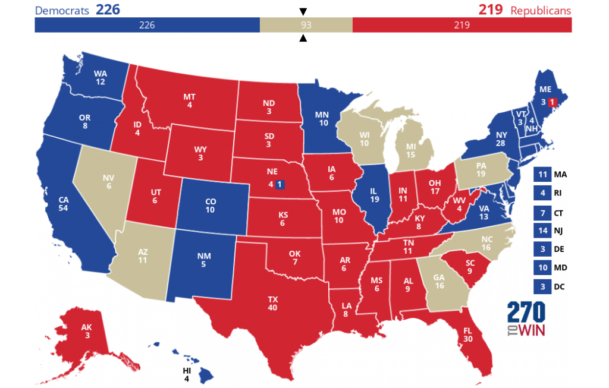
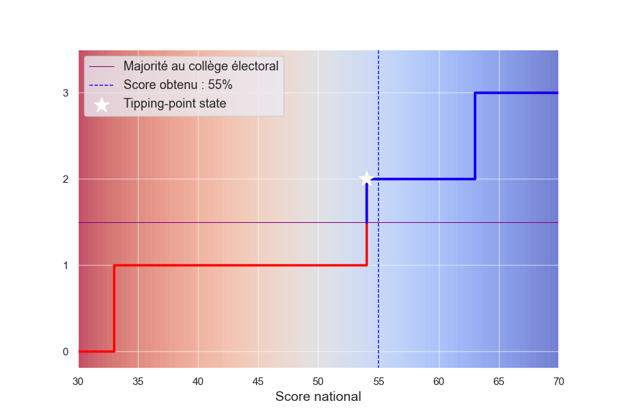
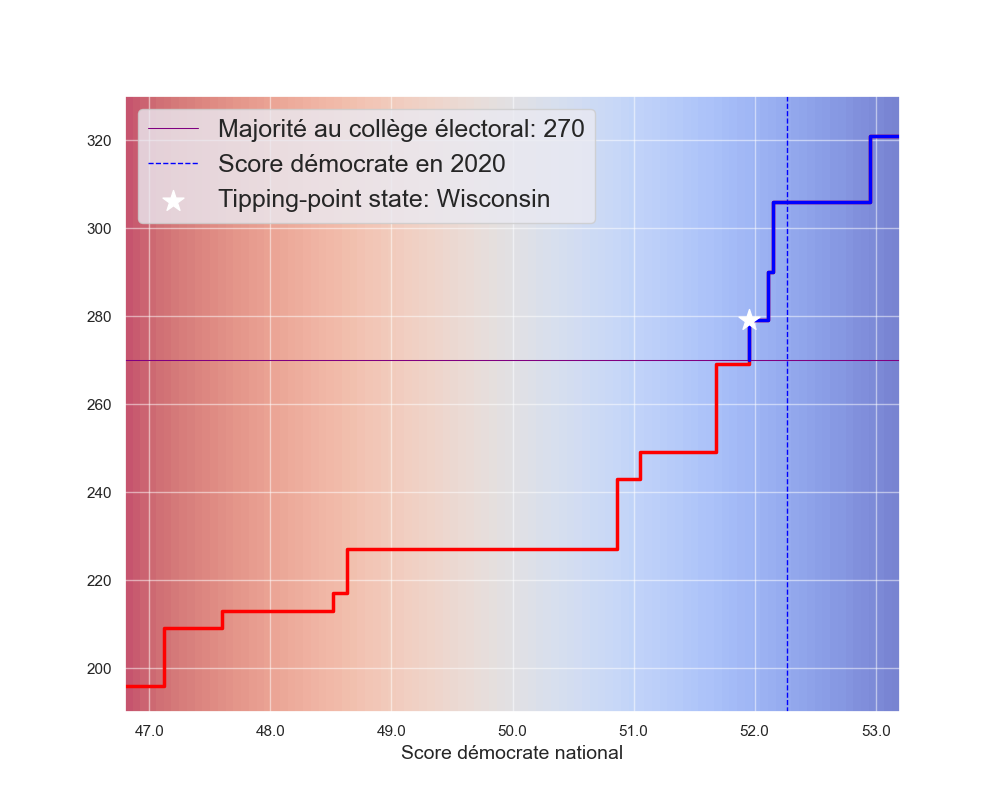

Tout système électoral indirect comporte le risque de créer un décalage entre le vote populaire et sa représentation finale. Nous allons essayer de quantifier ce biais structurel dans le cycle électoral actuel et examiner les facteurs qui en sont responsables.

Commençons par une énigme : supposez qu'une élection se déroule dans deux circonscriptions, et que pour la gagner un candidat doive remporter ces deux circonscriptions. Si sa probabilité de victoire dans chaque circonscription est de 50 %, quelle est finalement la probabilité qu'e le candidat gagne'l soit vainqueur ? Sachez que 25 % n'est pas la bonne réponse.

## 1) Étude Qualitative

### a) Présentation d'un modèle

Pour mieux comprendre les biais du système du collège électoral, nous allons recourir à une modélisation volontairement simplifiée de ce dernier, mais qui nous permettra d'extraire déjà des conclusions qualitatives sur ce mode de scrutin.

Nous considérons ainsi la tenue d'une élection générale dans un pays fédéral. La représentation électorale est attribuée au niveau de chaque état selon la règle du **winner-takes-all**. Cette nation est composée par 50 États sous les hypothèses suivantes :

- **Répartition uniforme** : Chaque État $i$ a une population identique et dispose donc du meme nombre de grands électeurs, que nous prenons à 2, ce qui amène à un total de 100. Ainsi, remporter 30 États signifie obtenir 60 grands électeurs, soit 60 % du total disponible

- **Bipartisme** : Il y a seulement deux partis ; si l'un obtient une certaine proportion des voix, l'autre reçoit le reste par symétrie. Nous n’étudierons donc qu’un seul parti, noté $P$.

- **Marge électorale** : Dans chaque État $i$, la marge de vote pour $P$, notée $x\_i$, suit une même distribution, notée $\\mathcal{D}$. Une marge positive signifie que $P$ obtient plus de 50 % des voix et remporte l’État ; une marge négative signifie une défaite.

L'hypothèse d'équidistribution de la population nous permet d'écrire que la marge nationale en voix populaires est :

\\\[  
S = \\text{marge populaire} = \\frac{1}{50} \\sum\_{i=1}^{50} x\_i = \\overline{x\_i}  
\\\]

Nous pouvons également exprimer le score en délégués obtenus :

\\\[  
\\text{score délégués} =2 \\cdot \\sum\_{i=1}^{50} \\, \\mathds{1}\_{\\{ x\_i > 50 \\% \\}}  
\\\]

où $\\mathds{1}\_{\\{ x\_i > 50 \\% \\}}$ est l'indicatrice de victoire dans l'état $i$. Par symétrie avec $x\_i$, nous allons en fait nous intéresser plutôt à la marge en grands électeurs :

\\\[  
D = \\text{marge délégués} =2 \\left( \\sum\_{i=1}^{50} \\, \\mathds{1}\_{\\{ x\_i > 50 \\% \\}} \\right)- 50  
\\\]

Ces variables nous permettent de carcatériser de façon pratique les sorts électoraux du parti $P$ :

- $S>0 \\iff$ victoire populaire

- $D>0 \\iff$ victoire en nombre de délégués

* * *

Revenons maintenant à notre énigme de départ. Quelles sont donc les chances qu'un candidat gagne deux États s’il a 50 % de chances de remporter chacun d’eux ? **La réponse dépend en fait de la corrélation entre les résultats des deux États**.

En effet, la formule habituelle :

\\\[  
\\mathbb{P}(A \\cap B) = \\mathbb{P}(A) \\cdot \\mathbb{P}(B)  
\\\]

n'est valable que si les événements $A$ et $B$ sont indépendants. Cette hypothèse est assez généralement postulée, soit que la corrélation soit en effet négligeable, soit par simple commodité de calcul. Or, dans le cadre de résultats électoraux, on observe une nette dépendance entre les variables, ce qui fait que la formule générale doit être utilisée :

\\\[  
\\mathbb{P}(A \\cap B) = \\mathbb{P}(A) \\cdot \\mathbb{P}(B) + \\operatorname{Cov}(A ,B )  
\\\]

Si les variables $A$ et $B$ suivent des lois de Bernoulli avec une probabilité de succès $p=\\frac{1}{2}$ et une corrélation $\\rho$, alors :

\\begin{align\*}  
\\mathbb{P}(A \\cap B) &= \\frac{1}{2} \\cdot \\frac{1}{2} + \\rho \\cdot \\sigma\_A \\cdot \\sigma\_B \\\\  
\\mathbb{P}(A \\cap B) &= \\frac{1 + \\rho}{4}  
\\end{align\*}

La prise en compte des corrélations est tant inhabituelle qu'il n'est pas forcément évident de se représenter des événements de Bernoulli corrélés. Pour se figurer une corrélation parfaite, $\\rho=1$, on peut voir l'issue dans $A$ et $B$ comme le résultat du **même** **lancer d'une pièce à pile ou face**. La probabilité de victoire au niveau de chaque état est bien de 50 %, mais la probabilité de victoire conjointe aussi, car les résultats des deux États sont toujours parfaitement alignés.

Inversement, pour une anticorrélation parfaite $\\rho= -1$, on assigne l'issue de $A$ et $B$ de façon opposée suivant le lancer de la même pièce, on a toujours 50% de chance remporter chaque état seul mais cette la victoire globale devient impossible : $\\mathbb{P}(A \\cap B) &= 0$.

Un signe que les résultats électoraux sont bien positivement corrélés est que la plupart des états incertains ont tendance à tous basculer du même coté. Nous allons par conséquent ajouter l'hypothèse suivante au modèle :

- **Intercorrélation entre états** : Les marges de victoire sont toutes corrélées entre elles par un meme facteur de corrélation : $\\operatorname{Corr}(x\_i, x\_j)= \\rho\_{i,j} = 0,5$ pour $i \\neq j$

Il nous suffit désormais de choisir une distribution $\\mathcal{D}$ décrivant $x\_i$, la marge électorale dans chaque État, pour être en mesure de réaliser une simulation de Monte-Carlo.

### b) Distribution normale

Pour commencer, un choix simple est de prendre une distribution normale centrée. Cette distribution possède des propriétés intéressantes pour notre étude :

- **Neutralité politique globale** : La moyenne $\\overline{x\_i} = 0$ indique une nation politiquement neutre dans l’ensemble.

- **Symétrie des partis** : La symétrie de $x\_i$ signifie en outre que les deux partis ont des chances équilibrées dans chaque État, ce qui simule une alternance possible mais équitable.

- **Concentration des résultats autour de 0** : Un écart-type de 5 % reflète des fluctuations électorales typiques, où chaque État est relativement équilibré d’une élection à l’autre.

Voici le résultat sur 1000 simulations de la marge en grands électeurs $D$ en fonction de la marge en vote populaire $S$ :

Notons que la distribution en "escalier" de $M$ provient du fait que cette variable est par définition entière. Le tracé obtenu révèle déjà ainsi plusieurs caractéristiques clés d’un système électoral à délégués sous la règle du **winner takes all**:

- **Alignement entre vote populaire et vote des grands électeurs**

En première lecture, le collège électoral retranscrit correctement la dynamique générale du vote populaire, car le nombre élevé d'États permet de compenser les éventuelles divergences locales et de lisser le résultat global

- **Amplification du vote populaire**

Un avantage national engendre des victoires massives en nombre de délégués. Cette amplification est due à la corrélation positive entre États : une avancée modeste a tendance à se propager sur l'ensemble du territoire, conduisant potentiellement à des victoires écrasantes (ou "landslides"). Cela s'est notamment produit lors de la victoire de Reagan en 1984, où il a remporté presque tous les États.

- **Possible divergence des deux modes de vote**

Dans les deux quadrants verts du graphique, les signes de $S$ et $D$ concordent, indiquant une cohérence entre résultats populaires et en représentation. En revanche, dans les quadrants rouges, $S$ et $D$ sont opposés, ce qui indique une divergence entre les vainqueurs selon chaque mode de scrutin. Bien que le grand nombre d'États permette souvent d’éviter ces divergences, elles deviennent probables lorsque le score national est serré.

### c) Distribution bimodale

Bien que ce modèle initial fondé sur une distribution gaussienne soit utile, il ne reflète pas la répartition observée des préférences électorales. Lors de l'élection présidentielle de 2020, par exemple, la distribution des marges relatives pour le parti démocrate montre des préférences partisanes nettes dans plusieurs États :

Pour affiner notre modèle, nous remplaçons donc la distribution normale par une distribution bimodale pour $x\_i$ la marge électorale de chaque État :

Cette approche permet de conserver les propriété de symétrie et de neutralité tout en représentant plus fidèlement la polarisation observée. Après avoir intégré cette loi bimodale dans notre modèle et réalisé 1000 nouvelles simulations, nous obtenons la courbe suivante :

Fait surprenant au premier abord, cette prise en compte de la polarisation produit une stabilisation dans la répartition des grands électeurs. Cela peut sembler contre-intuitif, mais s'explique par le fait que le résultat électoral au niveau d'un État sera principalement déterminé par son appartenance partisane, et non sa variance.

Cette idée retranscrit bien l'idée communément admise selon laquelle les résultats sont largement prévisibles d’une élection à l’autre : les bastions démocrates votent de manière systématique pour le parti démocrate, tandis que les bastions républicains restent fidèles aux républicains. L’issue du scrutin est en fait dictée par le sort d'un nombre restreint d'États qui concentrent l’incertitude.

En tenant compte des tendances historiques et des sondages, nous pouvons présenter une carte des États-Unis avec 270towin illustrant la couleur politique de chaque État :

<figure>

<figcaption>

Consensus pour 2024

</figcaption>

</figure>

Sauf surprise majeure, les États en bleu voteront pour les démocrates et ceux en rouge pour les républicains. Il est donc attendu que chaque candidat constitue un socle électoral minimal indépendamment de la marge du vote national le 5 novembre. Ce sont les _swing states_, ici identifiés en beige, qui devraient donc décider du vainqueur de l’élection présidentielle.

### d) Critique du modèle

Ce modèle simplifié nous aide à identifier certains mécanismes clés du système électoral américain, comme l’effet de levier exercé par des marges de vote modestes, le rôle des _swing states_ et la possibilité d’un décalage entre le vote populaire national et le résultat en grands électeurs. Cependant, pour estimer de manière plus réaliste et quantitative les biais potentiels en faveur d’un parti ou de l’autre, ce modèle présente plusieurs limites qu’il convient de souligner.

Premièrement, les hypothèses de départ sont réductrices. En supposant que chaque État a un poids électoral égal, nous négligeons une caractéristique essentielle de la structure fédérale des États-Unis : le découpage actuel des États n’est pas homogène. En réalité, les petits États, souvent ruraux, ont un poids électoral supérieur par habitant, introduisant un biais en leur faveur. Par ailleurs, ce sont souvent les _swing states_ les plus peuplés qui constituent les principaux leviers du résultat final.

Deuxièmement, la distribution des marges électorales que nous utilisons est « sans mémoire » : à chaque simulation, nous générons un nouveau $x\_i$, c'est-à-dire une nouvelle marge de vote dans l'État $i$, indépendamment des tendances observées lors des élections précédentes. Or, dans la réalité, les États présentent une forte inertie politique : les marges électorales évoluent généralement de manière continue, influencées par des tendances historiques, culturelles et sociales.

Enfin, la corrélation entre les résultats électoraux d’un État et de ses voisins pourrait être affinée. En effet, les États appartenant à la même région partagent souvent des caractéristiques culturelles et politiques qui se traduisent par des corrélations plus fortes de leurs résultats électoraux.

Pour surmonter ces limites et développer un modèle prédictif plus robuste, il serait pertinent d’intégrer ces éléments : la pondération des États en fonction de leur nombre réel de grands électeurs, une mémoire historique des préférences électorales, et peut-être aussi une modélisation des effets géographiques et démographiques. En enrichissant le modèle avec ces ajustements, nous poserons les fondations d'un outil plus précis pour prédire les résultats d'une élection américaine, ce qui fera l'objet d'un projet annexe.

## 2) Étude Quantitative

### a) Tipping-point state

Pour quantifier le biais de représentation dans le système électoral américain, nous introduisons ici la notion de _**tipping-point state**_, ou "État charnière". Cet État est identifié en classant les États selon leurs marges de vote, du plus favorable au moins favorable pour un parti, jusqu'à atteindre les 270 grands électeurs nécessaires pour une majorité. L’État où ce seuil est franchi devient alors le tipping-point state, car sa bascule permet d’atteindre la majorité.

Pour illustrer cette notion, prenons l’exemple de trois circonscriptions fictives — A, B, et C — ayant chacune la même population et le même nombre de grands électeurs. Les votes sont répartis initialement ainsi :

72%

28%

51%

49%

42%

58%

Dans ce scénario, le parti bleu semble bien positionné :

- Ils obtient la majorité en voix avec un score de : (72%+51%+42%)/3=55%

- Il gagne la majorité des circonscriptions (deux sur les trois)

Mais ce résultat est plus fragile qu’il n’y paraît : la circonscription B est remportée d'extrême justesse. Imaginons maintenant que le soutien national au parti bleu baisse uniformément de 2%, affectant de façon égale chacune des circonscriptions. La nouvelle répartition des votes devient alors :

70%

30%

49%

51%

40%

60%

Avec cette réduction de 2%, le score national du parti bleu s’établit à 53%, ce qui reste une majorité, toutefois, la circonscription B bascule en faveur du parti rouge, inversant le résultat en grands électeurs. Cette circonscription joue donc le rôle du tipping-point state.

Nous pouvons poursuivre cette idée en faisant varier le soutien national pour différentes valeurs positives et négatives, ce qui produit une courbe liant le score national au nombre de délégués obtenus :

Les discontinuités de la courbe marquent les basculements successifs des circonscriptions au fur et à mesure que le score global du parti bleu s'améliore. Le changement de couleur au franchissement de la moitié du total des délégués matérialise la transition entre une victoire pour le parti rouge et une victoire pour le parti bleu.

### b) Quantification du biais

Selon cette méthode de projection, le parti bleu a donc besoin d'obtenir 54% du total des voix pour faire basculer le tipping point state. Cela trahit que la configuration électorale lui est en fait défavorable puisqu'elle l'oblige à surperformer au niveau national pour s'assurer une victoire. Le score obtenu dans le tipping point state peut ainsi servir de mesure de l'avantage ou du désavantage induit par les disparités de répartition électorale.

En effet, les lecteurs avertis auront reconnu que la circonscription A manifeste un schéma de _packing_ (concentration des voix) tandis que circonscription C manifeste un schéma de _cracking_ (dispersion des voix). Comme étudié précédemment, des disparités de ce type dans la distribution des électeurs provoquent des écarts avec la représentation en délégués.

Aux États Unis, du fait d'une polarisation croissante entre zones urbaines démocrates, et zones rurales qui penchent plutôt du cote républicain, de nombreux états se rapportent à l'une ou l'autre des ces situations. Il est important de remarquer que même si ce phénomène fait penser à du gerrymandering, le tracé des frontières est ici le fruit de raisons historiques et démographiques et non d'une manipulation intentionnelle.

En pratique des biais vont se produire dans les deux sens, mais comme l'ont montré les derniers cycles électoraux leur résultante a tendance à favoriser le parti républicain. Pour visualiser cela nous pouvons tracer la courbe de l'exemple précédent dans le contexte de l'élection de 2020. Nous utilisons le décompte des voix enregistrés et normalisons les scores en ne tenant compte que des partis républicain et démocrate, respectivement représentés en rouge et en bleu :

<figure>

<figcaption>

**Grands électeurs obtenus pour le parti démocrate**

</figcaption>

</figure>

### c) Analyse politique

Cette courbe révèle une réalité frappante : l’avance des démocrates dans le collège électoral est bien plus faible qu’on ne pourrait le croire en se fondant uniquement sur leur score national. Lorsqu’on projette un score autour de 50 %, leur gain en grands électeurs stagne et ce n’est qu’au-delà d’un seuil critique, situé approximativement à 52 %, que plusieurs États pivot basculent simultanément, renversant leur statut.

L’élection de Joe Biden en 2020 illustre parfaitement ce phénomène. Sa victoire a reposé sur des marges serrées dans plusieurs États-clés légèrement biaisés en faveur des républicains, comme la Pennsylvanie, le Wisconsin et l’Arizona. Ces États, bien qu’étant des _swing states_, affichent un léger biais en faveur des républicains, ce qui accentue l’importance pour les démocrates de mobiliser fortement leur base pour surmonter ce désavantage.

Un autre point d’intérêt émerge à la lecture de ce graphique : la possibilité d’une égalité en grands électeurs (269-269), due au nombre pair de délégués dans le système électoral américain (538). Ainsi, le tipping-point state, en tant que premier État permettant de franchir strictement la barre de 269 grands électeurs peut différer selon les partis. Dans l’élection de 2020 par exemple, le tipping-point state pour Joe Biden était le Wisconsin, alors qu’il s'agissait de la Pennsylvanie pour Donald Trump.

Se concentrer sur les États proches du tipping-point peut être vu comme un **chemin de moindre résistance** vers la victoire. En ciblant ces États charnières, un parti peut optimiser ses ressources et maximiser ses chances, sans nécessairement chercher à obtenir une majorité populaire nationale écrasante. Cette approche stratégique consiste à identifier les marges les plus faibles et à diriger les efforts de campagne sur les territoires où un basculement serait à la fois possible et décisif.

Ainsi, beaucoup d'encre coula pour critiquer la stratégie de campagne de Hillary Clinton en 2016, qui a concentré une part importante de ses efforts dans des États comme l’Arizona et la Caroline du Nord, où elle cherchait à étendre son avance supposée par des sondages qui la surestimaient en réalité. En négligeant des États susceptibles de jouer le rôle de _tipping-point_, comme le Wisconsin, le Michigan et la Pennsylvanie, où les marges de vote étaient plus serrées qu'attendu, elle a laissé un espace décisif pour le basculement en faveur de Donald Trump.

### d) Limites de cette analyse

Bien que la notion de tipping-point state puisse éclaire l'analyse, elle comporte plusieurs limites qu’il est important de prendre en compte :

- **Bipartisme**

L'hypothèse d'un système bipartite strict, ne prenant en compte que les scores des partis démocrate et républicain, pourrait être révisée dans la mesure où les biais calculés sont du même ordre de grandeur que les scores attribués aux tiers partis

- **Corrélation parfaite**

Les projections reposent sur l’hypothèse que toute variation du score national se répercute uniformément dans chaque État, ce qui est irréaliste. Plus on s’éloigne du score observé, plus les projections deviennent incertaines, voire absurdes, comme lorsque des scores dépassant 100 % sont attribués à des États déjà massivement acquis à un parti.

- **Analyse a posteriori**

Le tipping-point state est une mesure qui se détermine **rétrospectivement**, en fonction des résultats d’une élection passée. Bien qu'il soit possible de l'inférer par l'analyse des sondages et par la résilience que de nombreux États affichent dans leurs préférences électorales, son utilité prospective reste donc limitée. En effet, des basculements subtils et progressifs peuvent modifier profondément la carte électorale.

Nous allons revenir sur le cas d'école que constitua l'élection présidentielle de 2016. De nombreux experts s'étant borné à une lecture statique des dynamiques électorales prédisaient alors une victoire facile à la candidate du parti démocrate, Hillary Clinton, alors qu'elle devait finalement enregistrer des défaites décisives dans des états jugés à tort imprenables.

## 3) Évolution des Tendances Politique

### a) Comparaison d'élections passées

Commençons par comparer les résultats des élections de 2012, 2016 et 2020 en traçant les courbes de gains en grands électeurs chacune des ces années pour le parti démocrate (la méthodologie est inchangée) :

ANALYSE ET BILAN DES RESULTATS

En 2016, Hillary Clinton a perdu l’élection malgré une majorité en voix populaires, soulignant à nouveau le désavantage structurel inhérent au système électoral américain. Ce mécanisme, capable d’inverser la volonté majoritaire, interroge dans le contexte d’une démocratie moderne. Pourtant, il perdure pour plusieurs raisons.

D’abord, le Collège électoral est perçu par beaucoup d’Américains comme un fondement de l’équilibre fédéral. Il garantit une voix aux États moins peuplés, contrebalançant l’influence des grandes métropoles. Cet attachement culturel a contribué à sa résilience. Ensuite, le manque de volonté politique pour réformer ce système a joué un rôle.

D'abord, beaucoup d'Américains y demeurent attachés et le voient comme la garantie de maintien d'une union fédérale équilibrée. Ensuite, il y a peut être eu un manque de volonté politique pour le reformer.

Une initiative majeure a pourtant été proposée : un pacte selon lequel des États, représentant collectivement au moins 270 grands électeurs, auraient attribué leurs délégués au candidat ayant obtenu la majorité des voix à l’échelle nationale, quelle que soit la répartition des votes dans leurs propres frontières.

Mais ce projet n’a jamais abouti, en partie parce que le Parti républicain, bénéficiant d’un avantage structurel, s’y est opposé. Certains démocrates, quant à eux, semblaient compter sur les évolutions démographiques pour modifier à terme les dynamiques électorales en leur faveur, ce qui a pu limiter leur engagement en faveur d'une réforme immédiate.

### b) Comment en est-on arrivé là ?

Effectivement, avant 2016 la conception qui prévalait alors était que les démocrates devaient rapidement et durablement dominer le collège électoral grâce à la forte croissance démographique des minorités ethniques. Leur soutien, que le parti démocrate tenait pour acquis, était censé renverser la domination républicaine dans plusieurs états très peuplés du sud, comme la Floride et le Texas

L’élection de Donald Trump en 2016 a radicalement remis en question ces certitudes. Non seulement il a ralenti, voire inversé, les progrès démocrates dans la Sun Belt, mais il a également brisé le blue wall en séduisant des électeurs issus de régions rurales et industrielles historiquement acquises aux démocrates.

Nous allons étudier l'évolution de la couleur politique des états en intrioduisant la notion de biais étatique :

En examinant les cycles 2016 et 2020, il devient clair que les démocrates ne peuvent plus se reposer uniquement sur leurs bastions historiques ou sur l’idée que les dynamiques démographiques joueront automatiquement en leur faveur.

Une analyse plus poussée devrait en fait décortiquer les résultats d états comme des coalitions électorales diverses a la croisee d'époque et de faits régionaux lies a la démographie de l état.

### Conclusion

Ces États deviennent alors le principal enjeu stratégique pour les deux partis, qui concentrent leurs efforts de campagne et leurs ressources pour gagner ces voix cruciales.

La cristallisation des enjeux de la campagne autour des swing states entraîne également un phénomène de clientélisme. Les candidats, et plus tard les élus, sont incités à prêter une attention particulière aux besoins des électeurs de ces états pour conserver leur soutien critique dans les élections présentes et futures. Les préoccupations spécifiques à ces États – parfois très éloignées de celles d’autres États moins disputés – prennent alors une importance démesurée, au détriment d’une politique nationale équitable et représentative.

De fait, la majorité des États sont largement ignorés dans les campagnes nationales, les partis les considérant soit déjà acquis, soit définitivement perdus.

Dans sa forme actuelle, le collège électoral ne garantit pas une représentativité équitable de tous les électeurs américains. Au contraire, il exacerbe les tensions entre États en favorisant une poignée de régions décisives, délaissant une large part du pays dans les campagnes et les priorités politiques.

mine l'égalité des citoyens dans l’expression de leur vote et, dans une certaine mesure, le caractère démocratique du processus. Les conséquences sont multiples : des électeurs peuvent se sentir exclus du processus électoral, et la polarisation politique s’intensifie. Favorise l extrémisme.

Toutes les démocraties se trouvent un jour confrontées au problème de la représentation équitable. Systems de représentation a la proportionnelle même cas prochain article.

Ces stratégies, bien qu’efficaces pour les partis au pouvoir, posent un défi important à la démocratie représentative, car elles créent des disparités entre le vote populaire et la répartition des sièges et jettent le discrédit. Aujourd'hui, la question mérite d'être posée ; avons nous toujours besoin de la représentation indirecte ?
