## Introduction

C’est la saison de la **foire aux vins** : les rayons débordent de bouteilles, et chacun espère dénicher la pépite qui fera plaisir sans se ruiner. En tant qu’amateur de vin et passionné de data, je me suis demandé : **et si les données pouvaient m’aider à repérer ces bonnes affaires ?**

Pour explorer cette idée, j’ai construit une base de données à partir du site d'une plateforme commerciale. J’ai ensuite mobilisé différents outils d’**apprentissage supervisé** afin d’estimer des prix de référence et détecter des profils atypiques.

## **1\. Data Mining et Data Cleaning**

La première étape a consisté en l'établissement d'une base de données fiable via un script de **web scraping**. Cette phase n’a rien d’anodin : les informations recueillies sont souvent partielles ou mal formatées. Il a donc fallu normaliser et homogénéiser les données avant toute analyse.

**Principaux traitements appliqués**

1. **Extraction** : récupération automatisée des caractéristiques de chaque vin (nom, type, provenance, millésime, labels, prix, etc.), en vérifiant la cohérence des données collectées.

3. **Nettoyage** : correction des erreurs (ex. « France » vs « FRANCE »).

5. **Normalisation des prix** :
    - prise en compte des promotions conditionnelles (ex. -20 % dès 6 bouteilles), réajustées pour obtenir un prix unitaire comparable ;
    
    - ajustement selon la contenance (ex. division par deux pour les magnums).

7. **Gestion des champs manquants** : certaines informations absentes (promos, notes) sont conservées comme valeurs manquantes, afin de pouvoir analyser leur impact.

**Structure finale de la base**

Chaque vin est décrit par un ensemble standardisé de variables :

<iframe src="https://nilradical.fr/rapports/wines_field_table.html" width="90%" height="800px" style="border:1px solid #ccc;"></iframe>

* * *

## **2\. Exploration des données**

### **2.1 Informations commerciales**

Les premiers champs de cette base fournissent simplement un contexte commercial : ils permettent de comprendre les conditions de vente sans influencer directement le modèle prédictif.

Nous notons toutefois les informations suivantes :

- **Promotions** : environ 26 % des vins référencés sur cette plateforme bénéficient d'une promotion. Parmi ceux-là, la remise médiane est de 25 %.

- **Contenances** : 96% des bouteilles ont une contenance standard (75 cl), mais certaines variations existent (magnums, demi-bouteilles, etc.)

### **2.2 Informations quantitatives**

Pour mieux comprendre la structure globale de la base, nous avons produit un aperçu synthétique de l’ensemble des variables à l’aide d’un rapport d’overview :

<iframe src="https://nilradical.fr/rapports/rapport_wines_info.html" width="90%" height="800px" style="border:1px solid #ccc;"></iframe>

Nous allons maintenant examiner progressivement les différentes dimensions du dataset.

##### **Distribution des prix**

La distribution des prix normalisés révèle un marché très hétérogène :

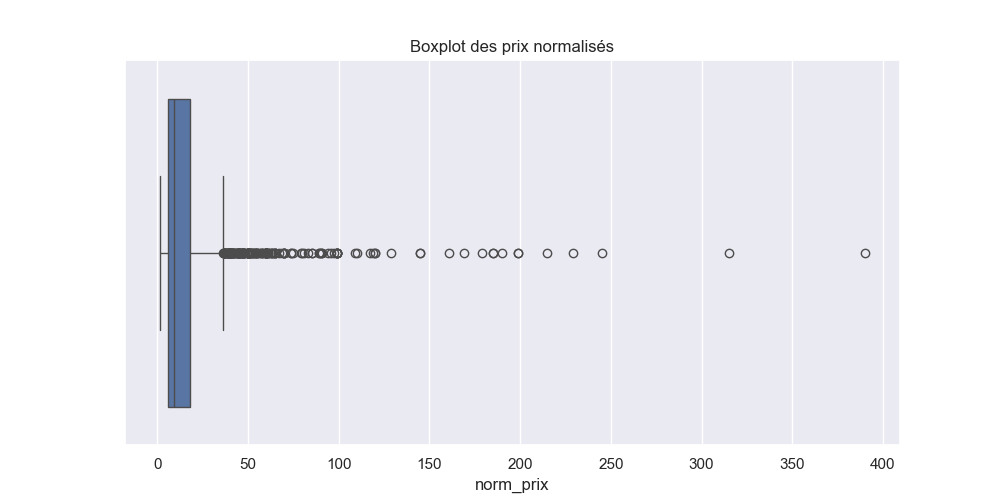

Sur cette boite à moustaches, on observe immédiatement la présence de valeurs extrêmes, correspondant à des bouteilles vendues à des prix très élevés. Ces outliers liés à des grands crus ou des éditions rares, bien que minoritaires, peuvent fortement influencer l’analyse statistique.

Pour se concentrer sur le cœur du marché, nous excluons les valeurs extrêmes selon le critère IQR (Q3 + 2 × IQR). Après **suppression de 133 valeurs**, la distribution des prix est plus représentative du marché classique :

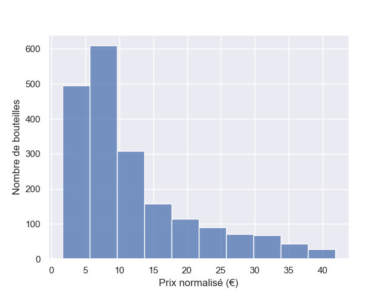

L'histogramme montre que la majorité des bouteilles se situe dans une fourchette basse, en dessous de 10 €, puis décroît progressivement. Cette observation confirme que, hors grands crus, le marché reste concentré autour de prix accessibles et homogènes.

##### **Types**

Voici une représentation de la répartition des vins selon leur type à l’aide d’un diagramme en camembert :

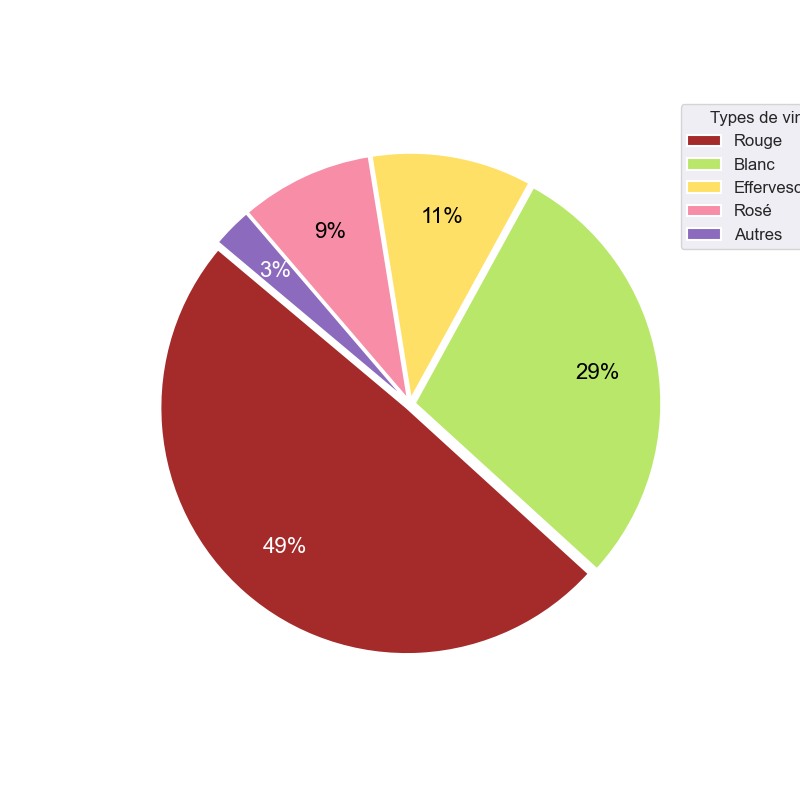

Cette première visualisation met en évidence la **domination des vins rouges et blancs**, tandis que les effervescents et les rosés restent minoritaires. La catégorie “Autres” qui regroupe Blanc Moelleux, Blanc Liquoreux et Orange (moins de 3 % des bouteilles) sera incorporée dans la classe “Blanc” pour simplifier l’analyse.

Pour aller plus loin, nous avons étudié la **distribution des prix par type de vin** à l’aide de boxplots :

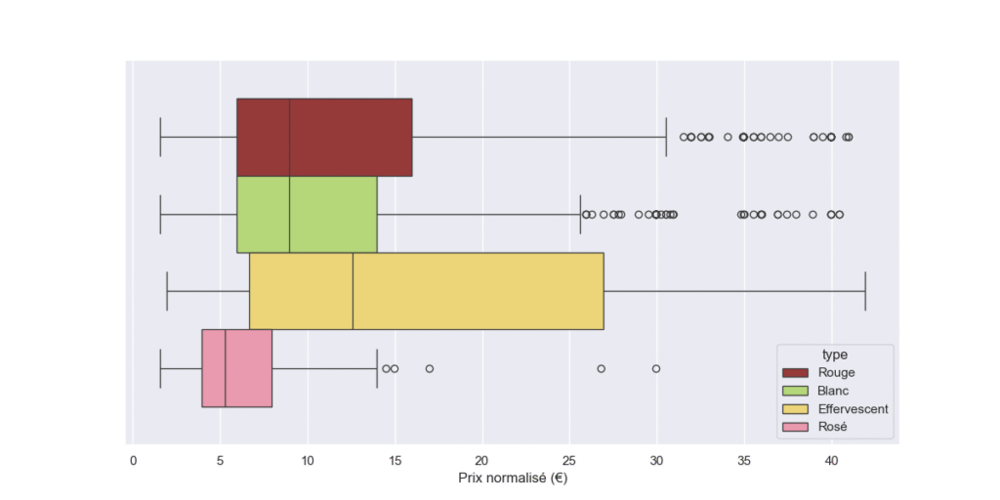

- **Rouge et Blanc** : ces deux catégories présentent un comportement de prix comparable.

- **Rosé** : ce segment de marché est concentré sur les prix bas.

- **Effervescent** : la distribution est très étendue. Elle reflète la diversité des produits compris dans cette catégorie, allant des crémants économiques, aux Prosecco de milieu de gamme, jusqu’aux Champagnes haut de gamme.

##### **Provenances**

Nous avons ensuite étudié la **répartition des vins selon leur provenance**. La visualisation principale est une **carte de France réalisée avec GeoPandas**, où chaque région est colorée selon la proportion de références présentes dans la base :

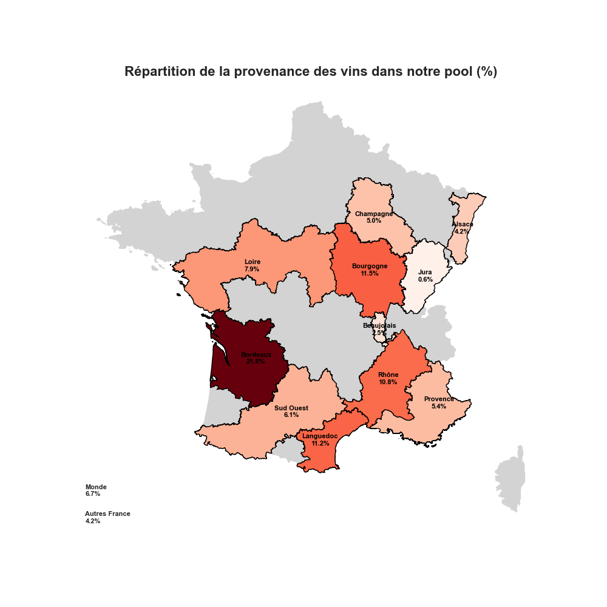

Cette carte met en évidence une **forte concentration sur quelques bassins viticoles bien connus** : Bordeaux domine avec 21,8 % des bouteilles, suivi de Bourgogne (11,5 %), Languedoc (11,2 %) et Rhône (10,8 %). Certaines régions, comme l’Alsace, le Beaujolais, la Corse, la Savoie ou le Jura, apparaissent moins investies dans le pool étudié.

Pour compléter cette observation, nous avons analysé **les prix par provenance à l’aide de boxplots**. Ces graphiques révèlent plusieurs comportements caractéristiques :

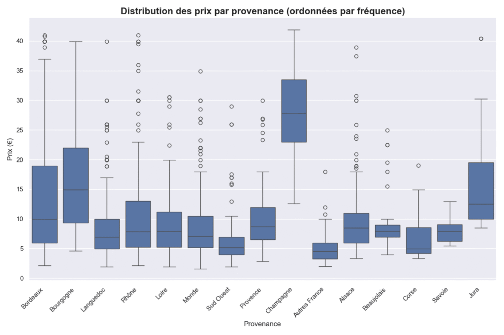

- **Champagne** : bien que minoritaire en nombre de références, cette région présente des prix **significativement élevés**, marquant un segment premium. C'est aussi le cas pour le **Jura** dans une moindre mesure.

- **Bordeaux et Bourgogne** : les deux principales catégories se distinguent par des prix généralement plus hauts, Bourgogne étant particulièrement bien positionnée sur le segment supérieur.

- **Sud-Ouest, Vins Sans Appelation et Beaujolais** : ces régions affichent des prix plus bas, en cohérence avec leur position sur le marché des vins **bon marché**.

##### **Millésime**

La répartition des millésimes illustre bien le positionnement « grande distribution » du panel étudié :

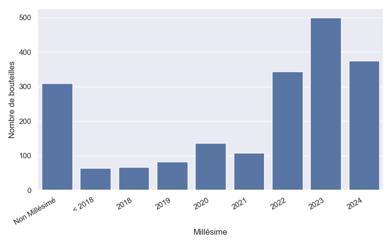

Près des deux tiers des vins proviennent des millésimes les plus récents (2022 à 2024) alors que les millésimes anciens sont nettement plus rare, ce qui trahit le privilège donné aux cuvées jeunes et rapidement commercialisables dans ce pool.

Un cas particulier mérite d’être signalé : les **vins non millésimés**, qui représentent environ 16 % de la base. Cette catégorie recouvre deux réalités différentes :

- d’un côté, les effervescents, et notamment le Champagne, où l’absence de millésime correspond à une pratique courante visant à garantir une constance de style d’année en année ;

- de l’autre, des vins d’entrée de gamme sans appellation précise, pour lesquels le millésime importe peu.

Cette double nature explique la forte variance de prix dans cette catégorie : on y trouve à la fois des bouteilles accessibles et des cuvées premium.

Enfin, l’analyse de la **corrélation entre millésime et prix (hors non millésimés)** confirme une relation négative attendue :

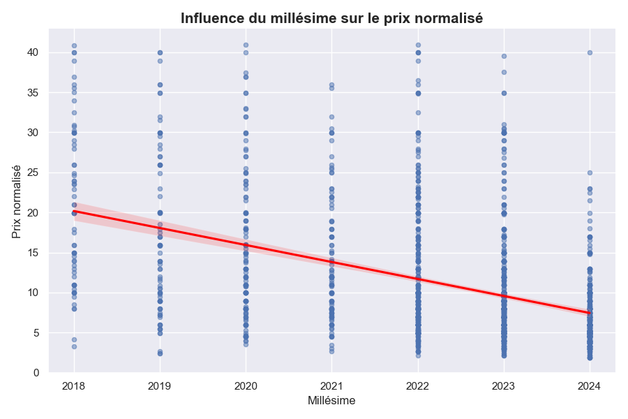

Plus un millésime est ancien, plus le prix tend à augmenter. Ce résultat reflète la logique de garde et de valorisation des cuvées avec le temps, même si cette dynamique reste atténuée dans notre échantillon, dominé par les millésimes récents.

##### **Labels**

Pour compléter l’analyse, nous avons étudié l’impact des indicateurs binaires sur le positionnement prix des vins : `is_pepite`, `is_medaille` et `is_bio`.

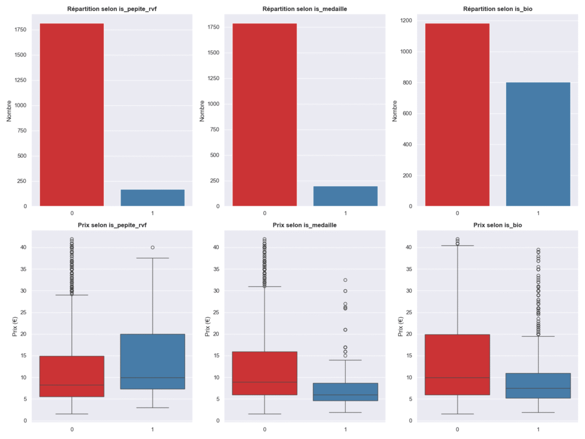

Les **countplots** montrent que la majorité des bouteilles ne disposent pas de label particulier. Les **boxplots** mettant en relation le prix et ces indicateurs révèlent des comportements intéressants :

- **is\_pepite** : les vins signalés comme pépites présentent en moyenne des prix légèrement plus élevés, reflétant leur positionnement qualitatif reconnu.

- **is\_medaille** : les vins médaillés apparaissent globalement moins chers que le reste du marché. Cela s’explique par le fait que les médailles sont souvent attribuées à des vins offrant un **excellent rapport qualité-prix**, plutôt qu’à des crus d’exception.

- **is\_bio** : les vins biologiques montrent également une tendance à avoir des prix légèrement inférieurs. Le label bio décrit une méthode de production respectueuse de l’environnement, mais n’est pas en soi un signe de prestige ou de rareté dans ce pool de grande distribution.

Cette analyse confirme que ces indicateurs binaires permettent d’affiner le **positionnement relatif** des vins au sein de leur segment, mais leur impact sur le prix absolu reste marginal. Ils agissent en qualité de **signaux secondaires**.

## **3\. Construction d'un modèle prédictif du prix**

#### **3.1  Philosophie de l’approche 🍷**

L’objectif du modèle de prédiction que nous tentons de bâtir ne repose pas tant sur sa performance que sur son aptitude à **fournir un prix de référence cohérent**. Ce prix théorique nous permettra d’identifier les écarts significatifs : un vin proposé bien en dessous du prix attendu devient un indicateur de bonne affaire, sans qu’il soit nécessaire de deviner le marché à l’euro près. Par exemple, si le modèle estime qu’un vin « devrait » valoir 20 € mais qu’il est proposé à 12 €, c’est déjà une **alerte sur une bonne affaire**.

#### **3.2 Construction des modèles** 🤖

##### ****Préparation des données**** :

- **Provenances rares** : Jura, Corse, Savoie et Beaujolais (<1 %) regroupés sous “Autres France” pour éviter le surapprentissage.

- **Millésimes** : toutes les années antérieures à 2017 regroupées en “Ancien”.

- **Valeurs manquantes** : la note RVF remplacée par la médiane (~13,5/20).

- **Encodage et séparation** : variables catégorielles transformées en indicatrices (one-hot), 80 % des données pour l’entraînement, 20 % pour le test.

##### **Modèles testés :**

- **Régression** **linéaire simple**

- **Régression réguliarisées** (ElasticNet) pour une base simple et interprétable.

- **Modèles non linéaires** (RandomForest, GradientBoosting) pour capturer des interactions complexes.

#### **3.3 Résultats**

L’évaluation des différents modèles montre des performances globalement limitées.

| Modèle | R² Train (%) | R² Test (%) | RMSE Train | RMSE Test |
| --- | --- | --- | --- | --- |
| Régression | 51.2 | 45.6 | 6.08 | 6.65 |
| ElasticNet | 51.1 | 45.3 | 6.09 | 6.67 |
| RandomForest | 63.6 | 48.3 | 5.26 | 6.49 |
| GradientBoosting | 57.9 | 46.6 | 5.65 | 6.59 |

Les **régressions réguliarisées** n’apportent aucun gain notable par rapport au modèle linéaire de base. Les **modèles non linéaires** capturent davantage d’interactions mais souffrent de surapprentissage.

**Conclusion** : le modèle linéaire simple est le plus pertinent : robuste, interprétable, et suffisant pour détecter les écarts significatifs dans chaque sous-segment.

#### **3.4 **Limites structurelles du modèle****

Les performances globales apparaissent limitées : les modèles testés expliquent **45 à 50 % de la variance (R²)**, avec un **RMSE autour de 6,5 €**. Rapporté à un marché où 80 % des vins se situent entre 0 et 15 €, cela revient à une **erreur moyenne équivalente à près de la moitié du prix réel** – un signal de fiabilité restreinte.

Le nuage de points « prix réel versus prix prédit » illustre clairement cette situation : même si la logique générale du marché est captée, les observations restent largement dispersées autour de la diagonale idéale (y = x) :

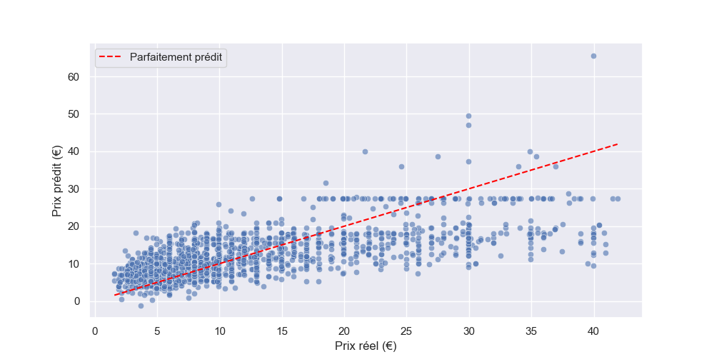

On observe par ailleurs un **retour à la moyenne** : les vins bon marché tendent à être **surévalués**, tandis que les vins chers sont **sous-évalués**. Ce biais n’est pas une tant une faiblesse technique que le le reflet d’une **limite structurelle** : le problème est en fait **sous-caractérisé**.

En effet, toute tentative de modélisation – même sophistiquée – se heurtera au fait que l’on cherche à prédire une variable continue (le prix) à partir de descripteurs essentiellement **catégoriels ou binaires**, donc peu discriminants. Même les variables numériques se révèlent de portée limitée :

- **Millésime** : concentré sur quelques années récentes, son signal reste faible.

- **Note RVF** : incomplète, quasi-catégorielle, dominée par deux valeurs récurrentes.

💡 Dans ces circonstances, des bouteilles à des prix très différents se retrouvent caractérisées par une **même combinaison de variables**. Pour éclairer tout cela, prenons l’exemple d’un **Bourgogne rouge 2022**. Son prix sera calculé en additionnant les paramètres pondérés par les coefficients :

_Intercept : 11,6 € + Bourgogne : +2 € – Millésime 2023 : –1 € …_

de sorte que toutes les bouteilles d’un même sous-segment se voient ainsi attribuer la même prédiction, de manière indifférenciée. Les coefficients de la régression linéaire apparaissent comme la **contribution moyenne** associée à chaque caractéristique.

Or, tout amateur sait « qu’il y a Bourgogne et Bourgogne » : au sein d’un même segment, la qualité (et donc le prix réel) varie considérablement selon le domaine, la parcelle, la réputation du producteur ou l’appellation précise. Faute de ces informations fines, le modèle ne peut capter cette hétérogénéité et ramène mécaniquement les extrêmes vers une valeur moyenne.

* * *

### 3.5 Analyse des bonnes affaires

Malgré ses limites prédictives, le modèle conserve une utilité pratique : il fournit un prix de référence par sous-segment de marché. Dans notre cadre, nous allons nous intéresser aux **résidus significativement négatifs**, c’est-à-dire des vins dont le prix net observé est largement inférieur au prix théorique estimé. Pour les identifier, nous avons standardisé les résidus en **Z-scores** et retenu les **10 valeurs les plus basses** :

📊 _Graphique associé : histogramme ou boxplot des résidus, avec mise en évidence des cas extrêmes._

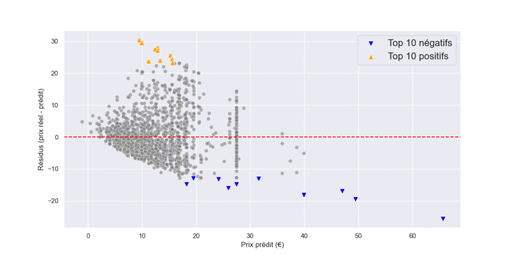

Une fois ces outliers isolés, nous les rapprochons de leur **niveau de remise** : lorsqu’un vin fortement sous-évalué bénéficie aussi d’une promotion marquée, il est vraisemblable que l’écart provienne d’une offre commerciale attractive. Cette méthode n’apporte pas une preuve mathématique en soi, mais elle constitue une **heuristique** combinant l’information « pratique » des remises observée et le signal « théorique » donné par le modèle.

📊 **Tableau final** : top 10 des « bonnes affaires candidates », indiquant prix net, prix théorique, remise et Z-score.

Enfin, à l’opposé, l’étude des **Z-scores positifs les plus élevés** permet de repérer des vins vendus **au-dessus du prix attendu**. Ces cas ne relèvent pas nécessairement de « mauvaises affaires », mais peuvent traduire soit des phénomènes de **surcotation**, soit une valorisation liée au **prestige ou à une qualité perçue comme exceptionnelle**.

* * *

👉 Tu pourras insérer ensuite une **discussion ciblée** : par exemple, montrer que certaines « bonnes affaires » correspondent à des promotions classiques en grande distribution, tandis que certains « écarts positifs » traduisent sans doute une valeur immatérielle (réputation d’un domaine, prestige d’une appellation).

## Conclusion

Dans un marché où le prix dépend de mille nuances — terroir, réputation, prestige, rareté — notre jeu de données reste contraint : essentiellement catégoriel, incomplet, et représentatif avant tout de la grande distribution. Dans ce contexte, il serait illusoire d’espérer une prédiction parfaite des prix.

Néanmoins, l’étude montre qu’un modèle linéaire simple suffit déjà à dégager des tendances cohérentes — comme le positionnement singulier du Champagne — et surtout à mettre en évidence des écarts significatifs entre prix théoriques et prix observés. C’est dans l’analyse de ces écarts que réside la véritable valeur ajoutée : identifier les bouteilles dont le prix net diverge fortement du prix de référence, et, en rapprochant ces écarts des promotions appliquées, repérer les opportunités commerciales crédibles, les « bonnes affaires ».

Ce travail pourrait être enrichi par des données plus fines (réputation des domaines, appellations précises), des notations expertes détaillées, un élargissement du spectre au-delà de la grande distribution, ainsi qu’un volume d’observations plus conséquent pour stabiliser les estimations et affiner les sous-segments du marché.

En somme, la donnée permet ici d’éclairer un marché complexe, de dégager des signaux utiles, et d’apporter un cadre rationnel à la recherche d’opportunités. Elle ne remplacera jamais l’œil du sommelier… ni le plaisir de la dégustation. 🍷

* * *
